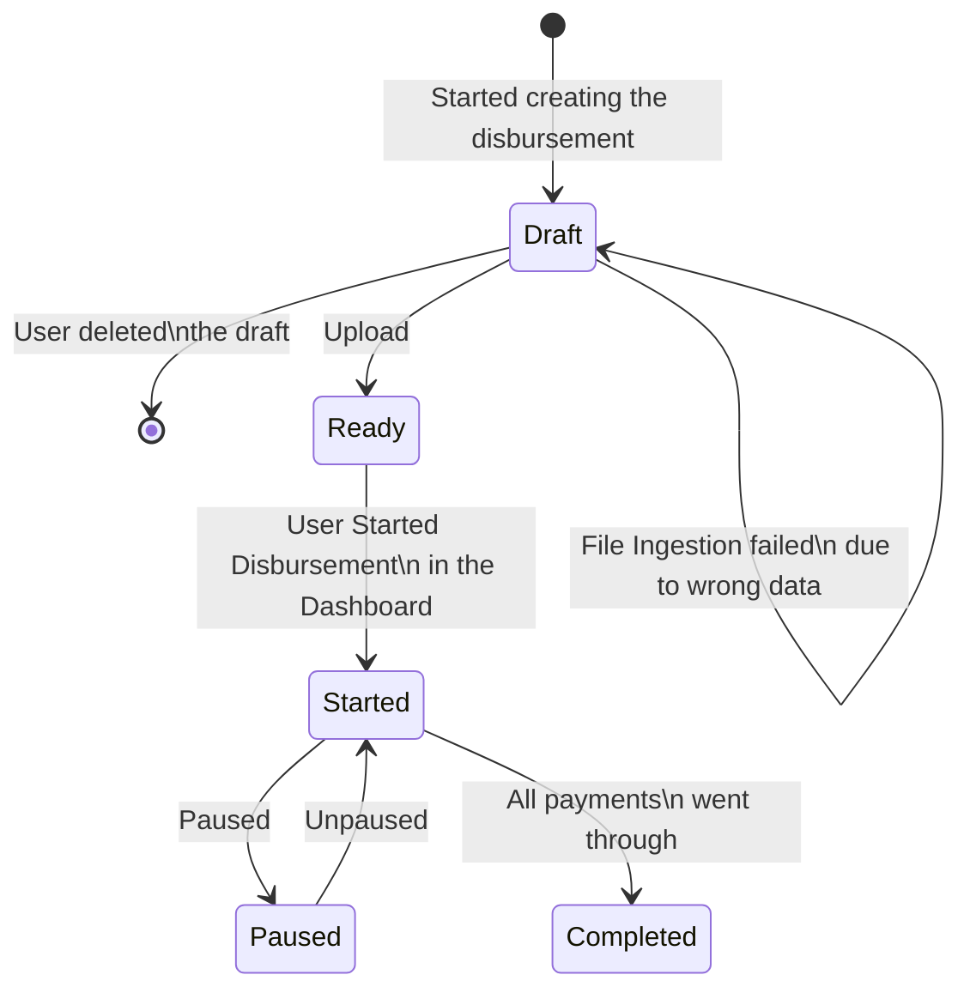
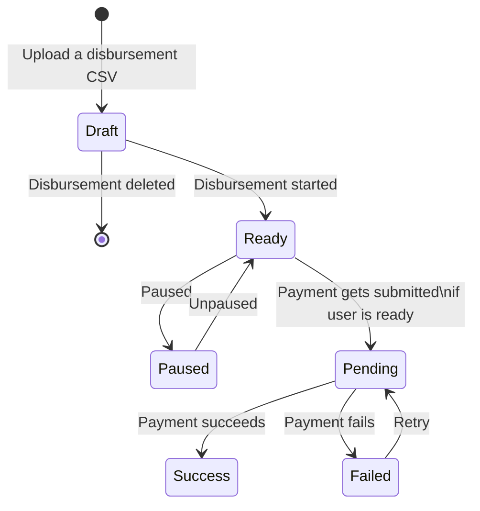
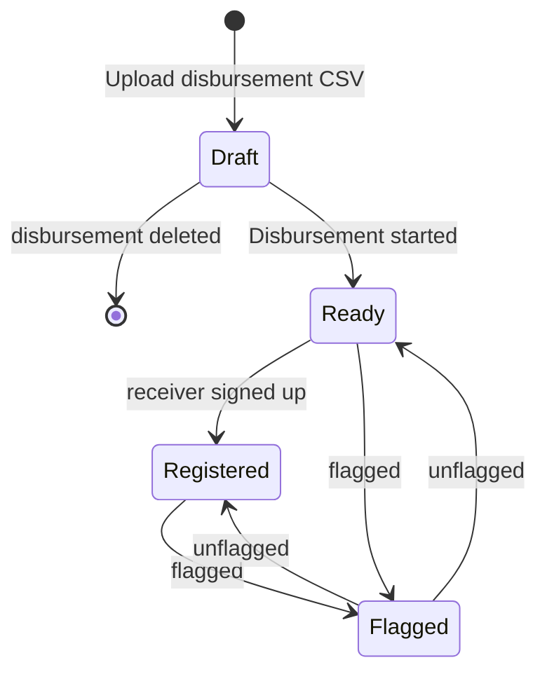
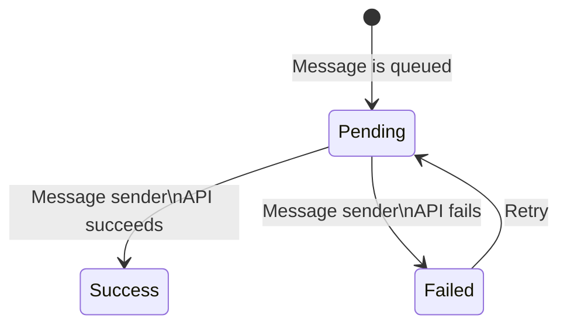

# Stellar Disbursement Platform Backend

## Table of Contents

- [Introduction](#introduction)
- [Install](#install)
- [Quick Start](#quick-start)
- [Architecture](#architecture)
  - [Core](#core)
  - [Transaction Submission Service](#transaction-submission-service)
  - [Database](#database)
- [SDP Operators](#sdp-operators)
  - [Supporting New Wallets](#supporting-new-wallets)
- [Wallets](#wallets)
  - [Recipient Registration Experience](#recipient-registration-experience)
  - [Deferred Deep Links](#deferred-deep-links)
  - [Wallet Registration Procedure](#wallet-registration-procedure)
- [Contributors](#contributors)
  - [State Transitions](#state-transitions)

## Introduction

The Stellar Disbursement Platform (SDP) enables organizations to disburse bulk payments to recipients using Stellar.

Throughout this documentation, we'll define "users" as members of the organization using the SDP to make payments, while defining "recipients" as those receiving payments.

## Install

Install golang and make sure `$GOPATH/bin` is in your `$PATH`. Then run the following.

``` sh
git clone git@github.com:stellar/stellar-disbursement-platform-backend.git
cd stellar-disbursement-platform-backend
make go-install
stellar-disbursement-platform --help
```

## Quick Start

To quickly test the SDP using preconfigured values, see the [Quick Start Guide](./dev/README.md).

## Architecture


The [SDP Dashboard][sdp-dashboard] and [Anchor Platform](https://github.com/stellar/java-stellar-anchor-sdk) components are separate projects that must be installed and configured alongside the services included in this project.

In a future iteration of this project, the Transaction Submission Service (TSS) will also be moved to its own repository to be used as an independent service. At that point, this project will include the services contained in the Core module shown in the diagram above.

### Core

The SDP Core service include several components started using a single command.

```sh
stellar-disbursement-platform serve --help
```

#### Dashboard API

The Dashboard API is the component responsible for enabling clients to interact with the SDP. The primary client is the [SDP Dashboard][sdp-dashboard], but other clients can use the API as well.

##### Metrics

The Dashboard API component is also responsible for exporting system and application metrics. We only have support for `Prometheus` at the moment, but we can add new monitors clients in the future.

#### Message Service

The Message Service sends messages to users and recipients for the following reasons:

- Informing recipients they have an incoming disbursement and need to register
- Providing one-time passcodes (OTPs) to recipients
- Sending emails to users during account creation and account recovery flows

Note that the Message Service requires that both SMS and email services are configured. For emails, AWS SES is supported. For SMS messages to recipients, Twilio is supported. AWS SNS support is not integrated yet.

If you're using the `AWS_EMAIL` sender type, you'll need to verify the email address you're using to send emails in order to prevent it from being flagged by email firewalls. You can do that by following the instructions in [this link](https://docs.aws.amazon.com/ses/latest/dg/email-authentication-methods.html).

#### Wallet Registration UI

The Wallet Registration UI is also hosted by the core server, and enables recipients to confirm their phone number and other information used to verify their identity. Once recipients have registered through this UI, the Transaction Submission Server (TSS) immediately makes the payment to the recpients registered Stellar account.

### Transaction Submission Service

Refer to documentation [here](/internal/transactionsubmission/README.md).

#### Core + TSS Integration

Currently, Core and Transaction Submission Service (TSS) interact at the database layer, sharing the `submitter_transactions` table to read and write state. The interaction is as follows:

1. Core inserts rows into the `submitter_transactions` table, queuing payments
2. The TSS polls the `submitter_transactions` table, detecting payments
3. For each payment detected, the TSS creates and submits a transaction to the Stellar network, monitoring its state until it is confirmed to have been included in a ledger or failed with a nonrecoverable error
4. Core's Dashboard API reads from the `submitter_transactions` table on demand to fetch the state of each payment

In future iterations of the project, the Transaction Submission Service will provide an API for clients such as the SDP to use for queuing and polling the state of transactions.

### Database

To manage the migrations of the database, use the `db` subcommand.

```sh
stellar-disbursement-platform db --help
```

Note that there is an `auth` subcommand that has its own `migrate` sub-subcommand. Operators of the SDP will need to ensure migrations for both the core and auth components are run.

```sh
stellar-disbursement-platform db migrate up
stellar-disbursement-platform db auth migrate up
```

#### Core Tables

The tables below are used to facilitate disbursements.


The tables below are used to manage user roles and organizational information.


#### TSS Tables

The tables below are shared by the transaction submission service and core service.


Note that the `submitter_transactions` table is used by the TSS and will be managed by the service when moved to its own project.

## SDP Operators

### Supporting New Wallets

Adding support for new wallets involves registering a new wallet in the database and correctly populating the `deep_link_schema` column.

Additionally, ensure the `sep_10_client_domain` column is correctly filled, matching the domain where the wallet provides a [SEP-10] authentication endpoint. 🚨 Note that this step is crucial for verifying the recipient's authentication from a trusted wallet. It's optional in the testnet environment.

When adding a wallet, you also need to provide the wallet `name` and `homepage`.

## Wallets

### Recipient Registration Experience

The recipient experience is as follows:

1. The recipient receives an SMS message notifying them they have a payment waiting from the organization and prompts them to click a [deep link] to open or install a wallet application
1. When the recipient opens the app, the wallet immediately onboards the recipient, creates a Stellar account and trustline for them, initiates a [SEP-24] deposit transaction with the SDP, and opens the SDP's registration webpage as an overlay screen/iframe inside the app.
1. The user confirms their phone number and date of birth and is prompted to return to the wallet application
1. The user receives the payment within seconds

### Deferred Deep Links

Most likely, the intended recipient will not have the necessary wallet application installed on their device. For this reason, wallets should support the concept of [deferred deep linking], which enables the following flow:

1. The recipient's initial action of clicking the deep link should redirect them to the appropriate app store to download the wallet application.
1. After installing and opening the application, the recpient should be rerouted to the wallet's typical onboarding flow.
1. Once the user has successfully onboarded, the wallet should use the information included in the deep link to kick off the [Wallet Registration Procedure](#wallet-registration-procedure).

Deferred deep linking is a feature commonly supported by numerous mobile deep linking solutions, there are third-party services that can be used to implement this functionality, such as Singular, Branch, AppsFlyer, Adjust, and others. [Here](https://medium.com/bumble-tech/universal-links-for-android-and-ios-1ddb1e70cab0) is a post with more information on how to implement deferred deep linking.

The registration link sent to recpients follows this format

```url
https://<host-with-optional-path>?asset=<asset>&domain=<domain>&name=<name>&signature=<signature>
```

- `asset`: the Stellar asset
- `domain`: the domain hosting the SDP's `stellar.toml` file
- `name`: the name of the organization sending payments
- `signature`: a signature from the SDP's [SEP-10] signing key

> Note that the deep link is specific to each SDP, payer org, and asset. It is not specific per individual receiver. There is no risk in sharing the link with receivers who are part of the same disbursement. The link will be the same for multiple receivers and they will proove their identity as part of the [SEP-24] deposit flow.

Below is an example of a registration link (signed)

```url
https://vibrantapp.com/sdp-dev?asset=USDC-GBBD47IF6LWK7P7MDEVSCWR7DPUWV3NY3DTQEVFL4NAT4AQH3ZLLFLA5&domain=ap-stellar-disbursement-platform-backend-dev.stellar.org&name=Stellar+Test&signature=fea6c5e805a29b903835bea2f6c60069113effdf1c5cb448d4948573c65557b1d667bcd176c24a94ed9d54a1829317c74f39319076511512a3e697b4b746ae0a
```

In this example, the host is `https://vibrantapp.com/sdp-dev` and the signature is the result of signing the below (unsigned) url using the [SEP-10] signing key `SBUSPEKAZKLZSWHRSJ2HWDZUK6I3IVDUWA7JJZSGBLZ2WZIUJI7FPNB5`, with the public key being `GBFDUUZ5ZYC6RAPOQLM7IYXLFHYTMCYXBGM7NIC4EE2MWOSGIYCOSN5F`:

```url
https://vibrantapp.com/sdp-dev?asset=USDC-GBBD47IF6LWK7P7MDEVSCWR7DPUWV3NY3DTQEVFL4NAT4AQH3ZLLFLA5&domain=ap-stellar-disbursement-platform-backend-dev.stellar.org&name=Stellar+Test
```

In this example, the signature is `fea6c5e805a29b903835bea2f6c60069113effdf1c5cb448d4948573c65557b1d667bcd176c24a94ed9d54a1829317c74f39319076511512a3e697b4b746ae0a`.

Below is a JavaScript snippet demonstrating how to verify the signature:

```js
#!/usr/bin/env node

const { Keypair } = require("stellar-sdk");

// The SDP's stellar.toml SIGNING_KEY
//
// For security, this should ideally be fetched from 
// https://<domain>/.well-known/stellar.toml on demand
const keypair = Keypair.fromPublicKey(
  "GBFDUUZ5ZYC6RAPOQLM7IYXLFHYTMCYXBGM7NIC4EE2MWOSGIYCOSN5F"
);
console.log("public key:", keypair.publicKey());

let url =
  "https://aidtestnet.netlify.app/aid?asset=USDC-GBBD47IF6LWK7P7MDEVSCWR7DPUWV3NY3DTQEVFL4NAT4AQH3ZLLFLA5&domain=ap-stellar-disbursement-platform-backend-dev.stellar.org&name=Stellar+Test"
let signature =
  "d8f5c9f0ece3118488d1546e1cb4071327a4f7f4f3efd5deefb8e92d668fca28504da8861f260c6ede26624d7a5bc244be1cf17c011e1994e3f45e2f19ea9b01"

console.log(
  "verified:",
  keypair.verify(
    Buffer.from(url.toString(), "utf8"),
    Buffer.from(signature, "hex"),
  ),
);
```

### Wallet Registration Procedure

1. Confirm that the `domain` of the deep link is on the wallet's allowlist. 🚨 This is crucial for authenticating from a trusted wallet.
1. Fetch the SDP's toml file at `{domain}/.well-known/stellar.toml` and confirm the `SIGNING_KEY` variable is populated.
1. Verify that the registration link signature was made using `SIGNING_KEY` similar to the `keypairPk.verify(...)` function in the snippet above.
1. Check the `asset` from the link and confirm that the recipient user has a trustline for that asset. Create one if it doesn't exist.
1. (Optional) Use the `name` from the link to update the wallet user interface.
1. Initiate the [SEP-24] deposit flow with that asset using the `TRANSFER_SERVER_SEP0024` value from the SDP's toml file.
   - This includes using [SEP-10] to authenticate the user with the SDP's server and implementing the `client_domain` check, as detailed in the [SEP-10] spec.
1. Launch the deposit flow interactive *in-app browser* within your mobile app, following the instructions in the [SEP-24] spec.
   - ATTENTION: the wallet should not, in any circumstances, scrape or attempt to scrape the content from the *in-app browser* for the recipient's information.
   - NOTE: It's highly recommended to use an *in-app browser* rather than a webview.
1. 🎉 Congratulations! The recipient user can now fill out the forms in the *in-app browser* and register to receive their payment 🎉.

Additionally, the wallet should save the link and/or link attributes and associate it with the individual receiving user for these reasons:

1. This is how the wallet will know that the user is associated with a certain org or SDP.
1. Saving the data is useful for reporting and troubleshooting, especially if the wallet needs to justify the source of funds for regulatory or tax purposes. Additionally, if the payer org wants to pay any cashout fees charged by the wallet or offramp, the wallet will need to know which users and transactions should be invoiced upstream.

## Contributors

This section is a work-in-progress.

### State Transitions

The state transitions of a disbursement, payment, message, and wallet (i.e. recipient Stellar account) are described below.

#### Disbursements



#### Payments



#### Recipient Wallets



#### Messages



[deferred deep linking]: https://en.wikipedia.org/wiki/Mobile_deep_linking#Deferred_deep_linking
[deep link]: https://en.wikipedia.org/wiki/Mobile_deep_linking
[SEP-10]: https://stellar.org/protocol/sep-10
[SEP-24]: https://stellar.org/protocol/sep-24
[sdp-dashboard]: https://github.com/stellar/stellar-disbursement-platform-frontend
