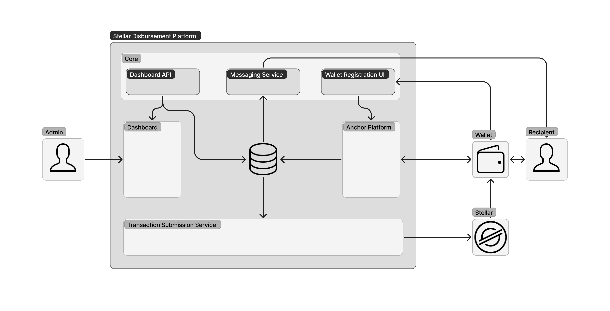
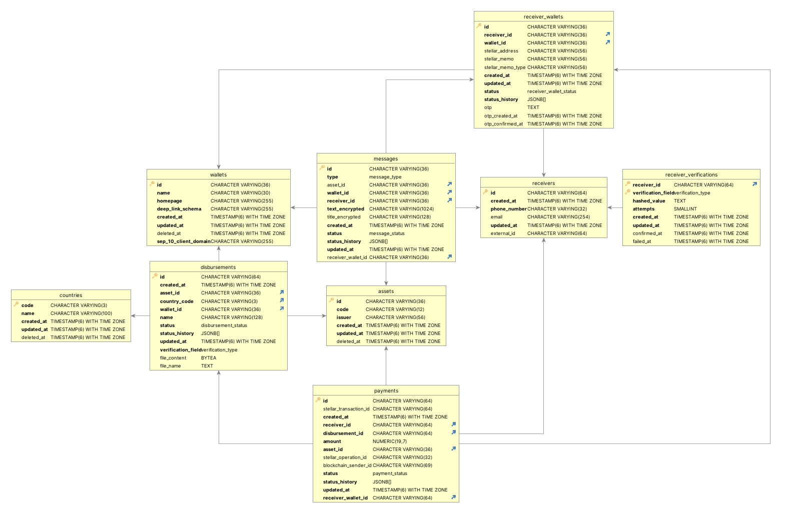
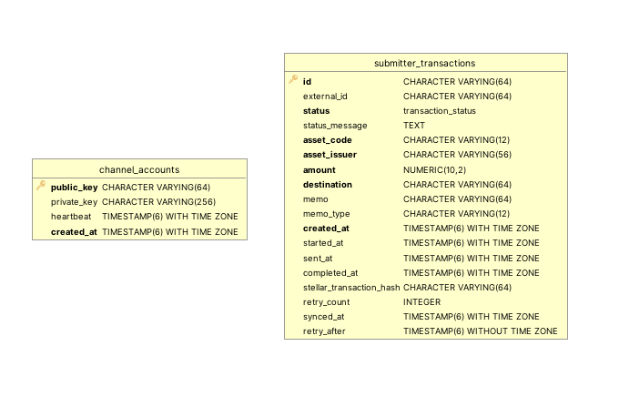
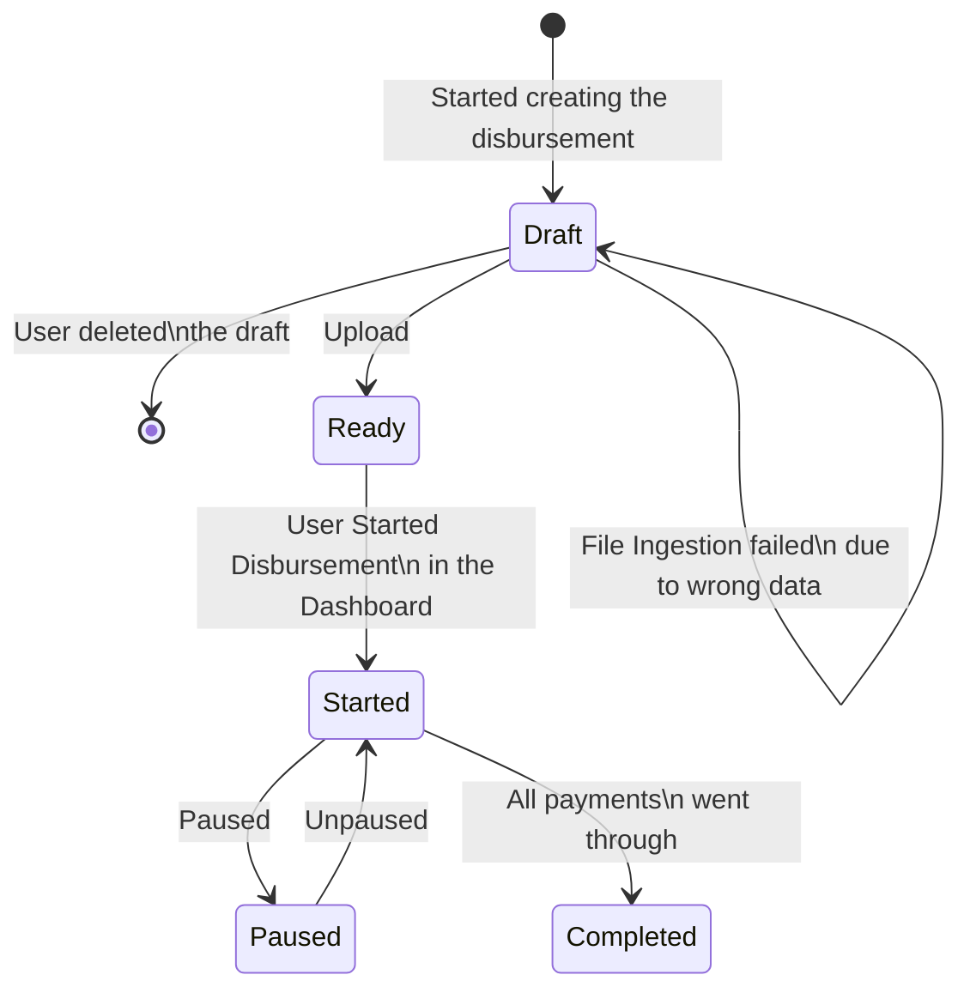
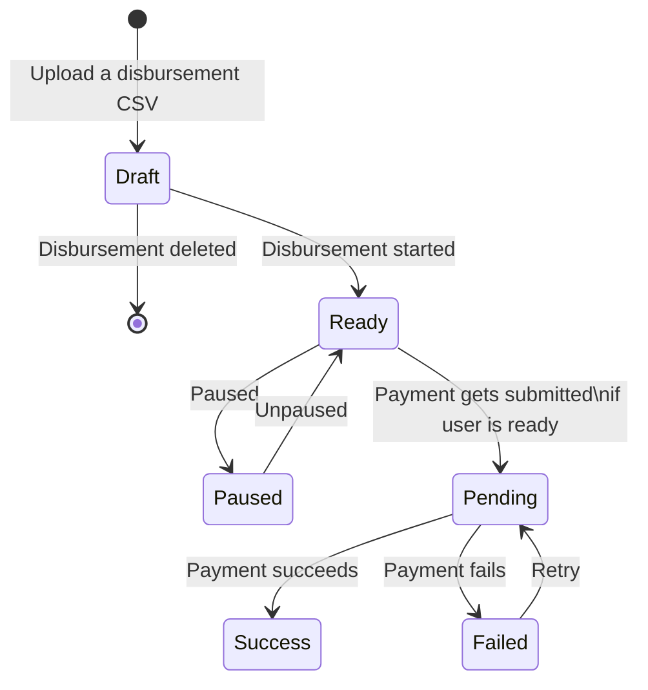
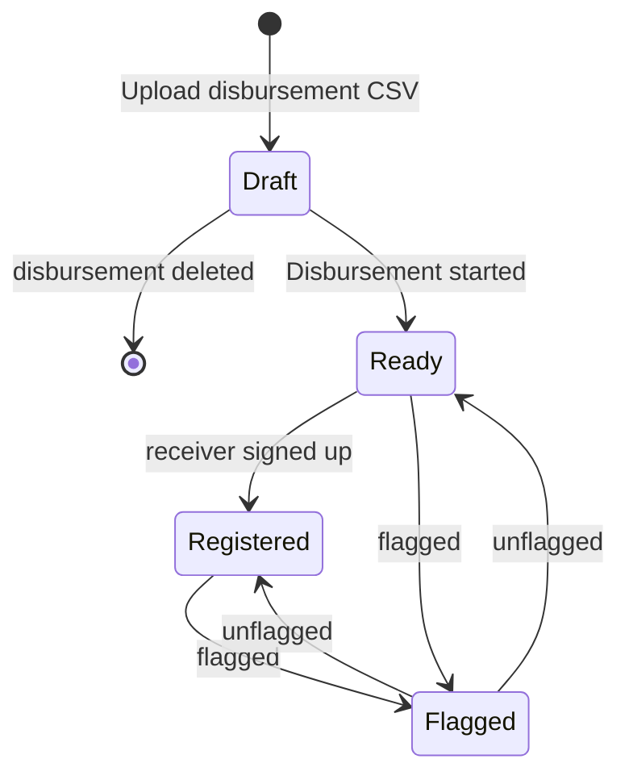
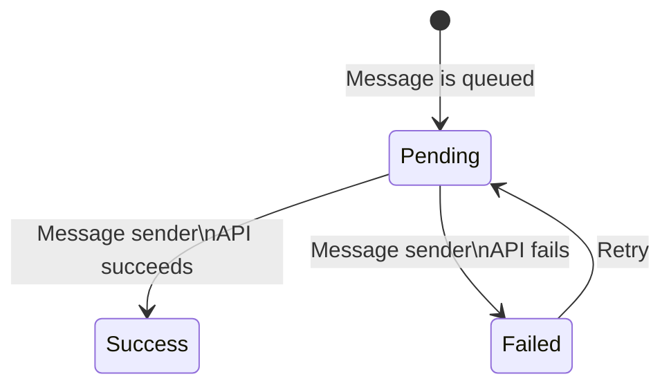

# Stellar Disbursement Platform Backend

> Note: you can find a more thorough and user-friendly documentation of this project at [Stelar Docs](https://docs.stellar.org/category/use-the-stellar-disbursement-platform).

## Table of Contents

- [Introduction](#introduction)
- [Install](#install)
- [Quick Start](#quick-start)
- [Architecture](#architecture)
  - [Core](#core)
  - [Transaction Submission Service](#transaction-submission-service)
  - [Database](#database)
- [Wallets](#wallets)
- [Contributors](#contributors)
  - [State Transitions](#state-transitions)

## Introduction

The Stellar Disbursement Platform (SDP) enables organizations to disburse bulk payments to recipients using Stellar.

Throughout this documentation, we'll define "users" as members of the organization using the SDP to make payments, while defining "recipients" as those receiving payments.

## Install

Install golang and make sure `$GOPATH/bin` is in your `$PATH`. Then run the following.

``` sh
git clone git@github.com:stellar/stellar-disbursement-platform-backend.git
cd stellar-disbursement-platform-backend
make go-install
stellar-disbursement-platform --help
```

## Quick Start

To quickly test the SDP using preconfigured values, see the [Quick Start Guide](./dev/README.md).

## Secure Operation Manual

This manual outlines the security measures implemented in the Stellar Disbursement Platform (SDP) to protect the integrity of the platform and its users. By adhering to these guidelines, you can ensure that your use of the SDP is as secure as possible.

Security is a critical aspect of the SDP. The measures outlined in this document are designed to mitigate risks and enhance the security of the platform. Users are strongly encouraged to follow these guidelines to protect their accounts and operations.

### Implementation of reCAPTCHA

Google's reCAPTCHA has been integrated into the SDP to prevent automated attacks and ensure that interactions are performed by humans, not bots.

ReCAPTCHA is enabled by default and can be disabled in the development environment by setting the `DISABLE_RECAPTCHA` environment variable to `true`.

**Note:** Disabling reCAPTCHA is not supported for production environments due to security risks.

### Enforcement of Multi-Factor Authentication

Multi-Factor Authentication (MFA) provides an additional layer of security to user accounts. It is enforced by default on the SDP and it relies on OTPs sent to the account's email.

MFA is enabled by default and can be disabled in the development environment by setting the `DISABLE_MFA` environment variable to `true`.

**Note:** Disabling MFA is not supported for production environments due to security risks.

### Best Practices for Wallet Management

The SDP wallet should be used primarily as a hot wallet with a limited amount of funds to minimize potential losses.

#### Hot and Cold Wallets

- A hot wallet is connected to the internet and allows for quick transactions.
- A cold wallet is offline and used for storing funds securely.
- Learn more about these concepts at [Investopedia](https://www.investopedia.com/hot-wallet-vs-cold-wallet-7098461).

### Distribution of Disbursement Responsibilities

To enhance security, disbursement responsibilities should be distributed among multiple financial controller users.

#### Recommended Configuration

1. **Approval Flow**: Enable the approval flow on the organization page to require two users for the disbursement process. The owner can do that at *Profile > Organization > ... > Edit details > Approval flow > Confirm*.
2. **Financial Controller Role**: Create two users with the *Financial Controller* role on the organization page to enforce separation of duties. The owner can do hat at *Settings > Team Members*.
3. **Owner Account Management**: Use the Owner account solely for user management and organization configuration. Avoid using the Owner account for financial controller tasks to minimize the exposure of that account.

## Architecture



The [SDP Dashboard][sdp-dashboard] and [Anchor Platform] components are separate projects that must be installed and configured alongside the services included in this project.

In a future iteration of this project, the Transaction Submission Service (TSS) will also be moved to its own repository to be used as an independent service. At that point, this project will include the services contained in the Core module shown in the diagram above.

### Core

The SDP Core service include several components started using a single command.

```sh
stellar-disbursement-platform serve --help
```

#### Dashboard API

The Dashboard API is the component responsible for enabling clients to interact with the SDP. The primary client is the [SDP Dashboard][sdp-dashboard], but other clients can use the API as well.

##### Metrics

The Dashboard API component is also responsible for exporting system and application metrics. We only have support for `Prometheus` at the moment, but we can add new monitors clients in the future.

#### Message Service

The Message Service sends messages to users and recipients for the following reasons:

- Informing recipients they have an incoming disbursement and need to register
- Providing one-time passcodes (OTPs) to recipients
- Sending emails to users during account creation and account recovery flows

Note that the Message Service requires that both SMS and email services are configured. For emails, AWS SES is supported. For SMS messages to recipients, Twilio is supported. AWS SNS support is not integrated yet.

If you're using the `AWS_EMAIL` sender type, you'll need to verify the email address you're using to send emails in order to prevent it from being flagged by email firewalls. You can do that by following the instructions in [this link](https://docs.aws.amazon.com/ses/latest/dg/email-authentication-methods.html).

#### Wallet Registration UI

The Wallet Registration UI is also hosted by the Core server, and enables recipients to confirm their phone number and other information used to verify their identity. Once recipients have registered through this UI, the Transaction Submission Server (TSS) immediately makes the payment to the recipients registered Stellar account.

#### Core + Anchor Platform Integration

For a full understanding on how the Core and Anchor Platform components interact, as well as the best security and configuration practices, please refer to the [Anchor Platform Integration Points](https://docs.stellar.org/stellar-disbursement-platform/anchor-platform-integration-points) section of the Stellar Docs.

### Transaction Submission Service

Refer to documentation [here](/internal/transactionsubmission/README.md).

#### Core + TSS Integration

Currently, Core and Transaction Submission Service (TSS) interact at the database layer, sharing the `submitter_transactions` table to read and write state. The interaction is as follows:

1. Core inserts rows into the `submitter_transactions` table, queuing payments
2. The TSS polls the `submitter_transactions` table, detecting payments
3. For each payment detected, the TSS creates and submits a transaction to the Stellar network, monitoring its state until it is confirmed to have been included in a ledger or failed with a nonrecoverable error
4. Core's Dashboard API reads from the `submitter_transactions` table on demand to fetch the state of each payment

In future iterations of the project, the Transaction Submission Service will provide an API for clients such as the SDP to use for queuing and polling the state of transactions.

### Database

To manage the migrations of the database, use the `db` subcommand.

```sh
stellar-disbursement-platform db --help
```

Note that there is an `auth` subcommand that has its own `migrate` sub-subcommand. Operators of the SDP will need to ensure migrations for both the core and auth components are run.

```sh
stellar-disbursement-platform db migrate up
stellar-disbursement-platform db auth migrate up
```

#### Core Tables

The tables below are used to facilitate disbursements.



The tables below are used to manage user roles and organizational information.


#### TSS Tables

The tables below are shared by the transaction submission service and core service.



Note that the `submitter_transactions` table is used by the TSS and will be managed by the service when moved to its own project.

## Wallets

Please check the [Making Your Wallet SDP-Ready](https://docs.stellar.org/stellar-disbursement-platform/making-your-wallet-sdp-ready) section of the Stellar Docs for more information on how to integrate your wallet with the SDP.

## Contributors

This section is a work-in-progress.

### State Transitions

The state transitions of a disbursement, payment, message, and wallet (i.e. recipient Stellar account) are described below.

#### Disbursements



#### Payments



#### Recipient Wallets



#### Messages



[sdp-dashboard]: https://github.com/stellar/stellar-disbursement-platform-frontend
[Anchor Platform]: https://github.com/stellar/java-stellar-anchor-sdk
