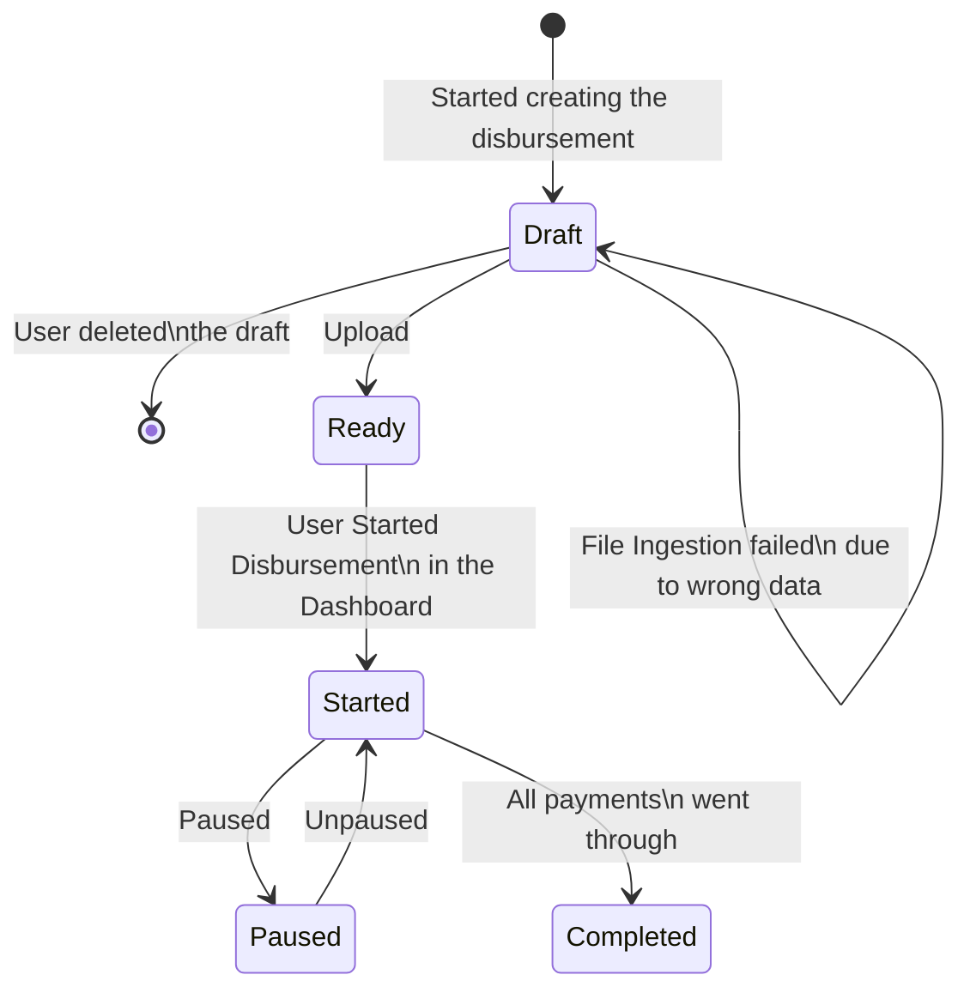
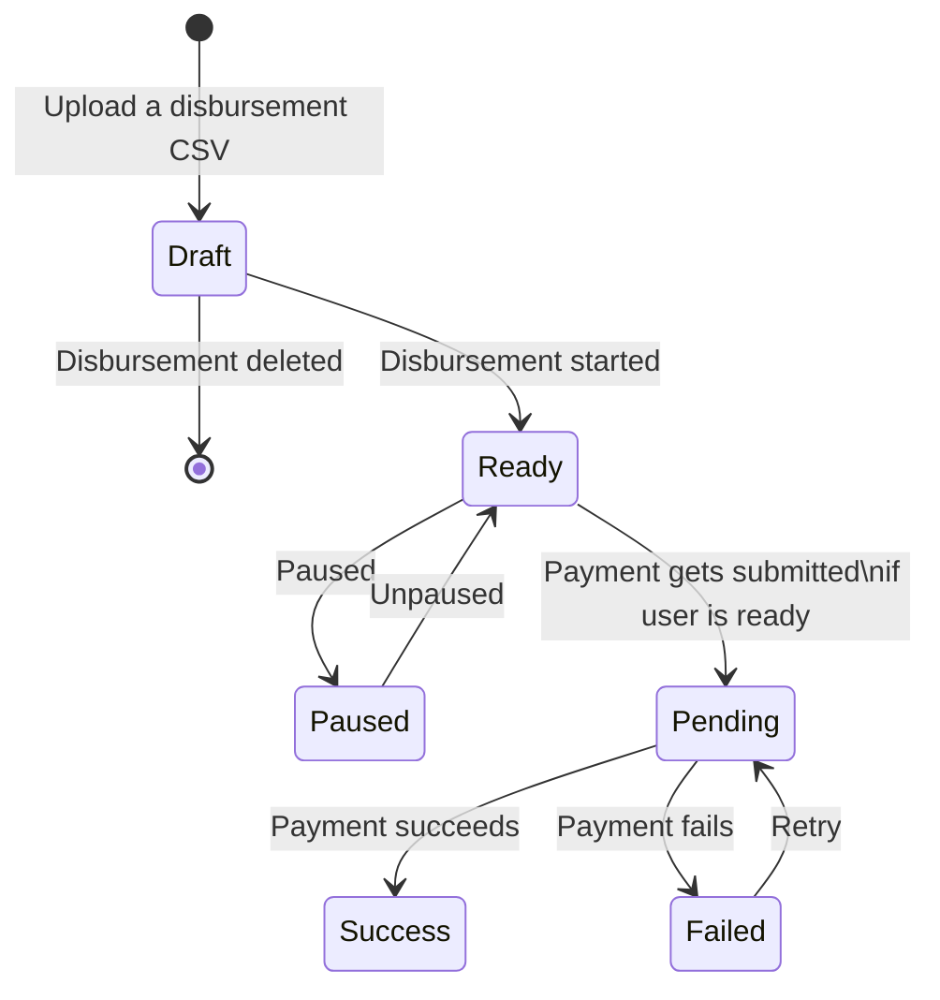
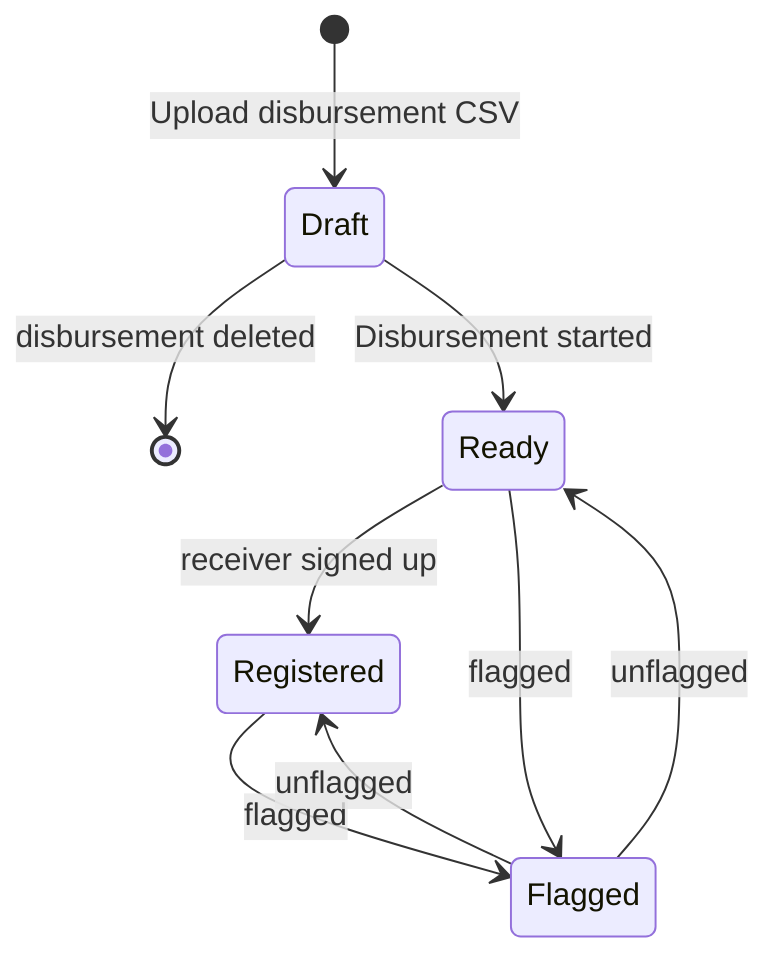
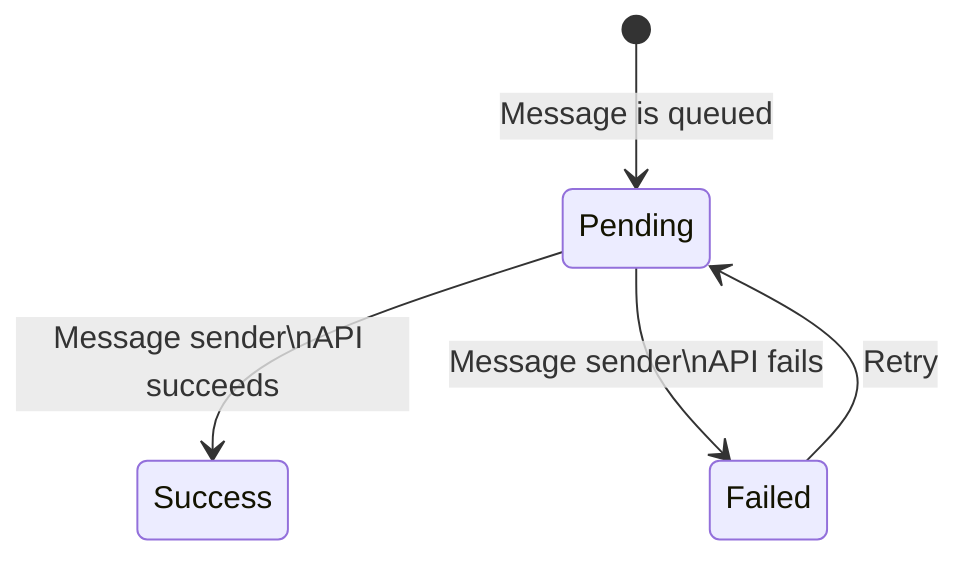

# Stellar Disbursement Platform Backend

> Note: you can find a more thorough and user-friendly documentation of this project at [Stelar docs](https://docs.stellar.org/category/use-the-stellar-disbursement-platform).

## Table of Contents

- [Introduction](#introduction)
- [Install](#install)
- [Quick Start](#quick-start)
- [Architecture](#architecture)
  - [Core](#core)
  - [Transaction Submission Service](#transaction-submission-service)
  - [Database](#database)
- [Wallets](#wallets)
- [Contributors](#contributors)
  - [State Transitions](#state-transitions)

## Introduction

The Stellar Disbursement Platform (SDP) enables organizations to disburse bulk payments to recipients using Stellar.

Throughout this documentation, we'll define "users" as members of the organization using the SDP to make payments, while defining "recipients" as those receiving payments.

## Install

Install golang and make sure `$GOPATH/bin` is in your `$PATH`. Then run the following.

``` sh
git clone git@github.com:stellar/stellar-disbursement-platform-backend.git
cd stellar-disbursement-platform-backend
make go-install
stellar-disbursement-platform --help
```

## Quick Start

To quickly test the SDP using preconfigured values, see the [Quick Start Guide](./dev/README.md).

## Architecture


The [SDP Dashboard][sdp-dashboard] and [Anchor Platform] components are separate projects that must be installed and configured alongside the services included in this project.

In a future iteration of this project, the Transaction Submission Service (TSS) will also be moved to its own repository to be used as an independent service. At that point, this project will include the services contained in the Core module shown in the diagram above.

### Core

The SDP Core service include several components started using a single command.

```sh
stellar-disbursement-platform serve --help
```

#### Dashboard API

The Dashboard API is the component responsible for enabling clients to interact with the SDP. The primary client is the [SDP Dashboard][sdp-dashboard], but other clients can use the API as well.

##### Metrics

The Dashboard API component is also responsible for exporting system and application metrics. We only have support for `Prometheus` at the moment, but we can add new monitors clients in the future.

#### Message Service

The Message Service sends messages to users and recipients for the following reasons:

- Informing recipients they have an incoming disbursement and need to register
- Providing one-time passcodes (OTPs) to recipients
- Sending emails to users during account creation and account recovery flows

Note that the Message Service requires that both SMS and email services are configured. For emails, AWS SES is supported. For SMS messages to recipients, Twilio is supported. AWS SNS support is not integrated yet.

If you're using the `AWS_EMAIL` sender type, you'll need to verify the email address you're using to send emails in order to prevent it from being flagged by email firewalls. You can do that by following the instructions in [this link](https://docs.aws.amazon.com/ses/latest/dg/email-authentication-methods.html).

#### Wallet Registration UI

The Wallet Registration UI is also hosted by the Core server, and enables recipients to confirm their phone number and other information used to verify their identity. Once recipients have registered through this UI, the Transaction Submission Server (TSS) immediately makes the payment to the recipients registered Stellar account.

#### Core + Anchor Platform Integration

The Wallet Registration flow kicks off within the recipient's wallet app. This app interacts with the [Anchor Platform] to initiate the [SEP-24] deposit process through the SDP (Stellar Disbursement Platform). The SDP collects the necessary recipient information to ultimately execute the payment to them.

Note that the [Anchor Platform] is a distinct project that is being deployed alongside the SDP and is needed for the receiver registration. It handles the implementation of interoperability protocols such as [SEP-1], [SEP-10], and [SEP-24], making their endpoints available to wallet apps. The [Anchor Platform] is pre-configured in both the Docker Compose file in the `dev` directory, and the helm chart.

To ensure a seamless integration between the SDP and the Anchor Platform, follow these steps:

1. 🚨 **Critical Step**: Configure the Anchor Platform with `PLATFORM_SERVER_AUTH_TYPE: JWT`. This setting is crucial for securing your Anchor Platform's backoffice API via JWT token authentication.
1. **Shared Secrets for API Authentication**: The `SECRET_PLATFORM_API_AUTH_SECRET` in the Anchor Platform should match `ANCHOR_PLATFORM_OUTGOING_JWT_SECRET` in the SDP.
1. **Shared Secrets for SEP-24**: The secrets `SECRET_SEP24_INTERACTIVE_URL_JWT_SECRET` and `SECRET_SEP24_MORE_INFO_URL_JWT_SECRET` in the Anchor Platform need to align with `SEP24_JWT_SECRET` in the SDP.
1. **SEP-10 Configuration**: The `SECRET_SEP10_SIGNING_SEED` in the Anchor Platform should be consistent with the `SEP10_SIGNING_PRIVATE_KEY` in the SDP.

By following these steps, you'll ensure a secure and efficient integration between your SDP and Anchor Platform systems.

##### Keeping the AP and SDP in Sync

Currently, some configurations within the Anchor Platform are static and loaded via environment variables. On the other hand, the SDP reads these same configurations from its database and allows an owner user to modify them. This dynamic pertains particularly to the lists of supported assets and wallets.

While we are actively exploring ways to automate this synchronization process, manual updates to the Anchor Platform configuration is currently required when registering or unregistering an asset or wallet on the SDP.

1. **(Required) Update Supported Assets**: Whenever you change the list of supported assets in the SDP, it's essential to update the Anchor Platform's `ASSETS_VALUE` configuration to reflect these changes. Consult the Docker Compose file or the helm values file for examples.
1. **(Recommended) Wallets and SEP-10 Domains**: If you employ the `SEP10_CLIENT_ATTRIBUTION_REQUIRED: true` setting in the Anchor Platform – a recommended best practice – you must also update the `SEP10_CLIENT_ATTRIBUTION_ALLOW_LIST` to include trusted wallet domains. This ensures that the Anchor Platform will process SEP-10 requests only from trusted wallets.

By following these steps, you'll maintain a consistent and secure state between your SDP and Anchor Platform instances.

### Transaction Submission Service

Refer to documentation [here](/internal/transactionsubmission/README.md).

#### Core + TSS Integration

Currently, Core and Transaction Submission Service (TSS) interact at the database layer, sharing the `submitter_transactions` table to read and write state. The interaction is as follows:

1. Core inserts rows into the `submitter_transactions` table, queuing payments
2. The TSS polls the `submitter_transactions` table, detecting payments
3. For each payment detected, the TSS creates and submits a transaction to the Stellar network, monitoring its state until it is confirmed to have been included in a ledger or failed with a nonrecoverable error
4. Core's Dashboard API reads from the `submitter_transactions` table on demand to fetch the state of each payment

In future iterations of the project, the Transaction Submission Service will provide an API for clients such as the SDP to use for queuing and polling the state of transactions.

### Database

To manage the migrations of the database, use the `db` subcommand.

```sh
stellar-disbursement-platform db --help
```

Note that there is an `auth` subcommand that has its own `migrate` sub-subcommand. Operators of the SDP will need to ensure migrations for both the core and auth components are run.

```sh
stellar-disbursement-platform db migrate up
stellar-disbursement-platform db auth migrate up
```

#### Core Tables

The tables below are used to facilitate disbursements.


The tables below are used to manage user roles and organizational information.


#### TSS Tables

The tables below are shared by the transaction submission service and core service.


Note that the `submitter_transactions` table is used by the TSS and will be managed by the service when moved to its own project.

## Wallets

Please check the [Making Your Wallet SDP-Ready](https://docs.stellar.org/stellar-disbursement-platform/making-your-wallet-sdp-ready) section of the Stellar Docs for more information on how to integrate your wallet with the SDP.

## Contributors

This section is a work-in-progress.

### State Transitions

The state transitions of a disbursement, payment, message, and wallet (i.e. recipient Stellar account) are described below.

#### Disbursements



#### Payments



#### Recipient Wallets



#### Messages



[SEP-1]: https://stellar.org/protocol/sep-1
[SEP-10]: https://stellar.org/protocol/sep-10
[SEP-24]: https://stellar.org/protocol/sep-24
[sdp-dashboard]: https://github.com/stellar/stellar-disbursement-platform-frontend
[Anchor Platform]: https://github.com/stellar/java-stellar-anchor-sdk
