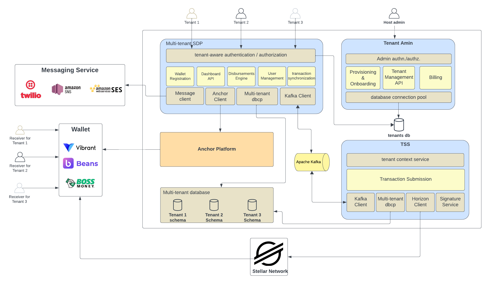

# Stellar Disbursement Platform Backend

[](https://petstore.swagger.io/?url=https://raw.githubusercontent.com/stellar/stellar-docs/refs/heads/main/openapi/stellar-disbursement-platform/bundled.yaml)
[](https://deepwiki.com/stellar/stellar-disbursement-platform-backend)
[](https://developers.stellar.org/platforms/stellar-disbursement-platform)
[](https://github.com/stellar/stellar-disbursement-platform-backend/actions/workflows/docker_image_public_release.yml)
[](https://goreportcard.com/report/github.com/stellar/stellar-disbursement-platform-backend)
[](https://github.com/stellar/stellar-disbursement-platform-backend/blob/main/LICENSE)
[](https://hub.docker.com/r/stellar/stellar-disbursement-platform-backend/tags)
[](https://github.com/stellar/stellar-disbursement-platform-backend/releases/latest)

> Note: you can find a more thorough and user-friendly documentation of this project at [Stellar Docs](https://docs.stellar.org/category/use-the-stellar-disbursement-platform).

## Table of Contents

- [Introduction](#introduction)
- [Install](#install)
- [Quick Start](#quick-start)
- [Architecture](#architecture)
  - [Core](#core)
  - [Transaction Submission Service](#transaction-submission-service)
  - [Database](#database)
- [Wallets](#wallets)
- [Contributors](#contributors)
  - [State Transitions](#state-transitions)

> [!NOTE]
> If you are using version 1.x.x, we highly recommend upgrading to version 2.x.x to benefit from the latest features, routine fixes, and security patches. 
> For detailed instructions on how to upgrade, please refer to [the upgrade guide](https://developers.stellar.org/network/stellar-disbursement-platform/admin-guide/single-tenant-to-multi-tenant-migration).

## Introduction

The Stellar Disbursement Platform (SDP) enables organizations to disburse bulk payments to recipients using Stellar.

Throughout this documentation, we'll define "users" as members of the organization using the SDP to make payments, while defining "recipients" as those receiving payments.

## Install

Install golang and make sure `$GOPATH/bin` is in your `$PATH`. Then run the following.

``` sh
git clone git@github.com:stellar/stellar-disbursement-platform-backend.git
cd stellar-disbursement-platform-backend
make go-install
stellar-disbursement-platform --help
```

## Quick Start

### Docker Compose 

To quickly test the SDP using preconfigured values, see the [Quick Start Guide](./dev/README.md).

### Helm 

To deploy the SDP using Helm, see the [Helm Chart](./helmchart/sdp/README.md).

## Secure Operation Manual

This manual outlines the security measures implemented in the Stellar Disbursement Platform (SDP) to protect the integrity of the platform and its users. By adhering to these guidelines, you can ensure that your use of the SDP is as secure as possible.

Security is a critical aspect of the SDP. The measures outlined in this document are designed to mitigate risks and enhance the security of the platform. Users are strongly encouraged to follow these guidelines to protect their accounts and operations.

### Implementation of reCAPTCHA

Google's reCAPTCHA has been integrated into the SDP to prevent automated attacks and ensure that interactions are performed by humans, not bots.

The SDP supports both reCAPTCHA v2 ("I'm not a robot") and reCAPTCHA v3 (invisible, score-based) implementations:

- **reCAPTCHA v2**: Traditional checkbox-based verification
- **reCAPTCHA v3**: Invisible verification that returns a score (0.0 to 1.0) indicating the likelihood of human interaction

#### Configuration

- **CAPTCHA_TYPE**: Specifies the type of CAPTCHA to use. Options: `GOOGLE_RECAPTCHA_V2` (default) or `GOOGLE_RECAPTCHA_V3`
- **RECAPTCHA_SITE_KEY**: The Google reCAPTCHA site key
- **RECAPTCHA_SITE_SECRET_KEY**: The Google reCAPTCHA site secret key
- **RECAPTCHA_V3_MIN_SCORE**: Minimum score threshold for reCAPTCHA v3 (0.0 to 1.0, default: 0.5). Only used when CAPTCHA_TYPE is `GOOGLE_RECAPTCHA_V3`
- **DISABLE_RECAPTCHA**: Set to `true` to disable reCAPTCHA entirely

ReCAPTCHA is enabled by default and can be disabled in the development environment by setting the `DISABLE_RECAPTCHA` environment variable to `true`.

**Note:** Disabling reCAPTCHA is supported for pubnet environments but this might reduce security!.

### Enforcement of Multi-Factor Authentication

Multi-Factor Authentication (MFA) provides an additional layer of security to user accounts. It is enforced by default on the SDP and it relies on OTPs sent to the account's email.

MFA is enabled by default and can be disabled in the development environment by setting the `DISABLE_MFA` environment variable to `true`.

**Note:** Disabling MFA is not supported for production environments due to security risks.

### Best Practices for Wallet Management

The SDP wallet should be used primarily as a hot wallet with a limited amount of funds to minimize potential losses.

#### Hot and Cold Wallets

- A hot wallet is connected to the internet and allows for quick transactions.
- A cold wallet is offline and used for storing funds securely.
- Learn more about these concepts at [Investopedia](https://www.investopedia.com/hot-wallet-vs-cold-wallet-7098461).

### Distribution of Disbursement Responsibilities

To enhance security, disbursement responsibilities should be distributed among multiple financial controller users.

#### Recommended Configuration

1. **Approval Flow**: Enable the approval flow on the organization page to require two users for the disbursement process. The owner can do that at *Profile > Organization > ... > Edit details > Approval flow > Confirm*.
2. **Financial Controller Role**: Create two users with the *Financial Controller* role on the organization page to enforce separation of duties. The owner can do hat at *Settings > Team Members*.
3. **Owner Account Management**: Use the Owner account solely for user management and organization configuration. Avoid using the Owner account for financial controller tasks to minimize the exposure of that account.

## Architecture



The [SDP Dashboard][sdp-dashboard] and [Anchor Platform] components are separate projects that must be installed and configured alongside the services included in this project.

In a future iteration of this project, the Transaction Submission Service (TSS) will also be moved to its own repository to be used as an independent service. At that point, this project will include the services contained in the Core module shown in the diagram above.

### Core

The SDP Core service include several components started using a single command.

```sh
stellar-disbursement-platform serve --help
```

#### Admin API 

The Admin API is the component responsible for managing tenants of the SDP. It runs by default on port 8003 and is used to provision new tenants and manage existing tenants. 

#### Dashboard API

The Dashboard API is the component responsible for enabling clients to interact with the SDP. The primary client is the [SDP Dashboard][sdp-dashboard], but other clients can use the API as well.

##### Metrics

The Dashboard API component is also responsible for exporting system and application metrics. We only have support for `Prometheus` at the moment, but we can add new monitors clients in the future.

#### Message Service

The Message Service sends messages to users and recipients for the following reasons:

- Informing recipients they have an incoming disbursement and need to register
- Providing one-time passcodes (OTPs) to recipients
- Sending emails to users during account creation and account recovery flows

Note that the Message Service requires that both SMS and email services are configured. For emails, AWS SES and Twilio Sendgrid are supported. For SMS messages to recipients, Twilio SMS, Twilio WhatsAPP and AWS SNS are supported.

If you're using the `AWS_EMAIL` or `TWILIO_EMAIL` sender types, you'll need to verify the email address you're using to send emails in order to prevent it from being flagged by email firewalls. You can do that by following the instructions in [this link for AWS SES](https://docs.aws.amazon.com/ses/latest/dg/email-authentication-methods.html) or [this link for Twilio Sendgrid](https://www.twilio.com/docs/sendgrid/glossary/sender-authentication).

##### Configuring Twilio WhatsApp

Configuring Twilio WhatsApp requires additional steps beyond the standard Twilio SMS setup.

**Prerequisites:**
1. Set up a Twilio WhatsApp Business Profile and complete the approval process
2. Create message templates in the Twilio Console for each type of message you plan to send
3. Wait for template approval before using them in production

**Message Templates Setup:**

You must create the following message templates in your Twilio Console and obtain their Template SIDs.

1. **Receiver Invitation Template** (`TWILIO_WHATSAPP_RECEIVER_INVITATION_TEMPLATE_SID`)
   - **Purpose**: Notify recipients about incoming disbursements
   - **Variables**: `{{1}}` = Organization Name, `{{2}}` = Registration Link
   - **Example**: "You have a payment waiting for you from the {{1}}. Click {{2}} to register."

2. **Receiver OTP Template** (`TWILIO_WHATSAPP_RECEIVER_OTP_TEMPLATE_SID`)
   - **Purpose**: Send one-time passwords to recipients during wallet registration
   - **Variables**: `{{1}}` = OTP Code, `{{2}}` = Organization Name
   - **Example**: "{{1}} is your {{2}} verification code."

**Configuration:**

Set the following environment variables:

```sh
SMS_SENDER_TYPE=TWILIO_WHATSAPP
TWILIO_ACCOUNT_SID=your_twilio_account_sid
TWILIO_AUTH_TOKEN=your_twilio_auth_token
TWILIO_WHATSAPP_FROM_NUMBER=whatsapp:+1234567890
TWILIO_WHATSAPP_RECEIVER_INVITATION_TEMPLATE_SID=HXxxxxxxxxxxxxxxxxxxxxxxxxxxxxxxxx
TWILIO_WHATSAPP_RECEIVER_OTP_TEMPLATE_SID=HXxxxxxxxxxxxxxxxxxxxxxxxxxxxxxxxx
```

**Important Notes:**
- The `TWILIO_WHATSAPP_FROM_NUMBER` must include the `whatsapp:` prefix and use your approved Twilio WhatsApp number
- Template SIDs are obtained from the Twilio Console after template creation and approval
- WhatsApp requires pre-approved message templates for all business-initiated conversations
- Template variables are automatically populated by the SDP based on the message type
- All templates must be approved by WhatsApp before they can be used in production
- For detailed setup instructions, refer to the [Twilio WhatsApp API documentation](https://www.twilio.com/docs/whatsapp/api) 

#### Wallet Registration UI

The Wallet Registration UI is also hosted by the Core server, and enables recipients to confirm their phone number and other information used to verify their identity. Once recipients have registered through this UI, the Transaction Submission Server (TSS) immediately makes the payment to the recipients registered Stellar account.

#### Core + Anchor Platform Integration

For a full understanding on how the Core and Anchor Platform components interact, as well as the best security and configuration practices, please refer to the [Anchor Platform Integration Points](https://docs.stellar.org/stellar-disbursement-platform/anchor-platform-integration-points) section of the Stellar Docs.

### Transaction Submission Service

Refer to documentation [here](/internal/transactionsubmission/README.md).

#### Core + TSS Integration

Currently, Core and Transaction Submission Service (TSS) interact at the database layer, sharing the `submitter_transactions` table to read and write state. The interaction is as follows:

1. Core inserts rows into the `submitter_transactions` table, queuing payments
2. The TSS polls the `submitter_transactions` table, detecting payments
3. For each payment detected, the TSS creates and submits a transaction to the Stellar network, monitoring its state until it is confirmed to have been included in a ledger or failed with a nonrecoverable error
4. Core's Dashboard API reads from the `submitter_transactions` table on demand to fetch the state of each payment

In future iterations of the project, the Transaction Submission Service will provide an API for clients such as the SDP to use for queuing and polling the state of transactions.

### Database

To manage the migrations of the database, use the `db` subcommand.

#### 

```sh
stellar-disbursement-platform db --help
```

#### Admin Tables

**Migration CMD**

```sh
stellar-disbursement-platform db admin migrate up
```

The tables below are used to manage tenants and their configurations. 


#### Core Tables

**Migration CMD**

The following command will migrate the tables used by the Core service for all tenants.

```sh
stellar-disbursement-platform db auth migrate up --all
stellar-disbursement-platform db sdp migrate up --all
```

It is also possible to migrate the tables for a specific tenant by using the `--tenant-id` flag.

```sh
stellar-disbursement-platform db auth migrate up --tenant-id=tenant_id
stellar-disbursement-platform db sdp migrate up --tenant-id=tenant_id
```

The tables below are used to facilitate disbursements.


The tables below are used to manage user roles and organizational information.


#### TSS Tables

**Migration CMD**

```sh
stellar-disbursement-platform db tss migrate up
```

The tables below are shared by the transaction submission service and core service.


Note that the `submitter_transactions` table is used by the TSS and will be managed by the service when moved to its own project.

### Event Brokers & Background jobs

The SDP can use either an Event Broker or Background jobs to handle asynchronous tasks. The choice depends on the requirements of the organization using the SDP.
Currently, the SDP only supports Kafka as an Event Broker even though it has been designed to support other brokers through the use of interfaces.

> [!NOTE]  
> In order to avoid concurrency issues, the SDP only supports one Event Broker or Background Jobs at a time.

#### Configuration Options

The SDP configuration is controlled by the `EVENT_BROKER_TYPE` environment variable:

* `EVENT_BROKER_TYPE=KAFKA` - Uses Kafka for event handling (recommended for multi-tenant deployments)
* `EVENT_BROKER_TYPE=SCHEDULER` - Uses background jobs (recommended for single-tenant deployments)


#### Kafka
We recommend Kafka for organizations that require high throughput and low latency. Organizations that plan on hosting multiple tenants on the SDP should consider using Kafka.

**1. Topics**

* `events.receiver-wallets.new_invitation`: This topic is used to send disbursement invites to recipients. *[Producer: Core, Consumer: Core]*
* `events.payment.ready_to_pay`: This topic is used to submit payments from the Core to the TSS. *[Producer: Core, Consumer: TSS]*
* `events.payment.circle_ready_to_pay`: This topic is used to submit Circle payments. *[Producer: Core, Consumer: Core]*
* `events.payment.payment_completed`: This topic is used to notify the Core that a payment has been completed. *[Producer: TSS, Consumer: Core]*

For each of the topics above, there is a dead letter topic that is used to store messages that could not be processed. The dead letter topics are named as follows:
* `events.receiver-wallets.new_invitation.dlq`
* `events.payment.ready_to_pay.dlq`
* `events.payment.circle_ready_to_pay.dlq`
* `events.payment.payment_completed.dlq`


**2. Configuration**

In order to use Kafka, you need to set the following environment variables for SDP and TSS. 

```sh
  EVENT_BROKER_TYPE: "KAFKA"
  BROKER_URLS: # comma separated list of broker urls
  CONSUMER_GROUP_ID: # consumer group id
  KAFKA_SECURITY_PROTOCOL: # possible values "PLAINTEXT", "SASL_SSL", "SASL_PLAINTEXT" or "SSL"
  KAFKA_SASL_USERNAME: # username for SASL authentication. Required if KAFKA_SECURITY_PROTOCOL is "SASL_SSL" or "SASL_PLAINTEXT"
  KAFKA_SASL_PASSWORD: # password for SASL authentication. Required if KAFKA_SECURITY_PROTOCOL is "SASL_SSL" or "SASL_PLAINTEXT"
  KAFKA_SSL_ACCESS_KEY: # access key (keystore) in PEM format. Required if KAFKA_SECURITY_PROTOCOL is "SSL"
  KAFKA_SSL_ACCESS_CERTIFICATE: # certificate in PEM format that matches the access key. Required if KAFKA_SECURITY_PROTOCOL is "SSL"
```

#### Background Jobs
We recommend Background Jobs for organizations that require a simpler setup and do not need high throughput or low latency. Organizations that plan on hosting a single tenant on the SDP should consider using Background Jobs.

**1. Jobs**

> [!NOTE]  
> Certain jobs are not listed here because they cannot be configured and are necessary to the functioning of the SDP. 

* `send_receiver_wallets_invitation_job`: This job is used to send disbursement invites to recipients. Its interval is configured through the `SCHEDULER_RECEIVER_INVITATION_JOB_SECONDS` environment variable.
* `payment_to_submitter_job`: This job is used to submit payments from Core to the TSS. Its interval is configured through the `SCHEDULER_PAYMENT_JOB_SECONDS` environment variable.
* `payment_from_submitter_job`: This job is used to notify Core that a payment has been completed. Its interval is configured through the `SCHEDULER_PAYMENT_JOB_SECONDS` environment variable.
* `patch_anchor_platform_transactions_completion`: This job is used to patch transactions in Anchor Platform once payments reach the final state 'SUCCESS' or 'FAILED'. Its interval is configured through the `SCHEDULER_PAYMENT_JOB_SECONDS` environment variable.

**2. Configuration**

In order to use Background Jobs, we need to set the following environment variable for Core. 

```sh
  EVENT_BROKER_TYPE: "SCHEDULER"
  SCHEDULER_RECEIVER_INVITATION_JOB_SECONDS: # interval in seconds
  SCHEDULER_PAYMENT_JOB_SECONDS: # interval in seconds
```

>[!NOTE]
>Prior to version 3.7.0, background jobs were configured using ENABLE_SCHEDULER=true and EVENT_BROKER_TYPE=NONE.
>This configuration has been deprecated in favor of using EVENT_BROKER_TYPE=SCHEDULER.

## Wallets

Please check the [Making Your Wallet SDP-Ready](https://docs.stellar.org/stellar-disbursement-platform/making-your-wallet-sdp-ready) section of the Stellar Docs for more information on how to integrate your wallet with the SDP.

## Contributors

This section is a work-in-progress.

### State Transitions

The state transitions of a disbursement, payment, message, and wallet (i.e. recipient Stellar account) are described below.

#### Disbursements


#### Payments


#### Recipient Wallets


#### Messages


[sdp-dashboard]: https://github.com/stellar/stellar-disbursement-platform-frontend
[Anchor Platform]: https://github.com/stellar/java-stellar-anchor-sdk
