# Quick Start Guide

## Table of Contents
- [Quick Start Guide](#quick-start-guide)
  - [Table of Contents](#table-of-contents)
  - [Introduction](#introduction)
  - [Quick Setup and Deployment](#quick-setup-and-deployment)
    - [Pre-requisites](#pre-requisites)
    - [Clone the repository:](#clone-the-repository)
    - [Update local DNS](#update-local-dns)
    - [Automated Stellar Account Creation and .env Configuration](#automated-stellar-account-creation-and-env-configuration)
    - [Install Multi-tenant SDP Locally](#install-multi-tenant-sdp-locally)
    - [Login to the SDP and send a Disbursement](#login-to-the-sdp-and-send-a-disbursement)
    - [Receive Payment to Digital Wallet (Deposit Flow)](#receive-payment-to-digital-wallet-deposit-flow)
  - [Additional Development Environment Details](#additional-development-environment-details)
    - [Stellar Accounts and .env File](#stellar-accounts-and-env-file)
    - [Building the SDP Docker Containers](#building-the-sdp-docker-containers)
    - [Remote Debugging](#remote-debugging)
      - [Ensure Docker Containers are Running:](#ensure-docker-containers-are-running)
      - [Using VS Code:](#using-vs-code)
      - [Using IntelliJ GoLang:](#using-intellij-golang)
    - [Monitoring the SDP](#monitoring-the-sdp)
      - [Start Prometheus and Grafana containers](#start-prometheus-and-grafana-containers)
      - [Load the SDP Grafana Dashboard](#load-the-sdp-grafana-dashboard)
  - [Troubleshooting](#troubleshooting)
      - [Sample Tenant Management Postman collection](#sample-tenant-management-postman-collection)
      - [Distribution account out of funds](#distribution-account-out-of-funds)

## Introduction

Follow these instructions to get started with the Stellar Disbursement Platform (SDP).

## Quick Setup and Deployment

### Pre-requisites

* **Docker:** Make sure you have Docker installed on your system. If not, you can download it from [here](https://www.docker.com/products/docker-desktop).
* **Git:** You will need Git to clone the repository. You can download it from [here](https://git-scm.com/downloads).
* **Go:** If you want to use the `make_env.sh` script to create Stellar accounts and a `.env` file, you will need to have Go installed on your system. You can download it from [here](https://golang.org/dl/).
* **jq:** If you want to use the `main.sh` script to bring up the local environment, you will need to have `jq` installed. You can install it using Homebrew:
```sh  
brew install jq
```

### Clone the repository:

```sh
git clone https://github.com/stellar/stellar-disbursement-platform.git
```

### Update local DNS
This update is needed to simulate the multi-tenant capabilities of the SDP. The SDP uses the subdomain of the request URL to resolve the tenant.
Be sure that the added tenant hosts are included in the host configuration file.
To check it, you can run the command `cat /etc/hosts`.
To include them, you can run command `sudo nano /etc/hosts` and insert the lines below:
```
127.0.0.1       bluecorp.stellar.local
127.0.0.1       redcorp.stellar.local
127.0.0.1       pinkcorp.stellar.local
```

### Automated Stellar Account Creation and .env Configuration

To automatically create Stellar accounts for SEP10 authentication and a distribution wallet, and to set up the necessary configuration values in a .env file, follow these steps: 

1. Navigate to the dev directory:
```sh
cd dev
```
2. Run the make_env.sh script:
```sh
scripts/make_env.sh
```

The script will generate new keypairs with a USDC funded distribution account and create the .env file with the following configuration values. Example:

```bash
# Generate a new keypair for SEP-10 signing
SEP10_SIGNING_PUBLIC_KEY=GCRSCJEVHB5JFXNZH3KYQRHSKDX3ZRFMMPKDPNX7AL3JSXJSILTV7DEW
SEP10_SIGNING_PRIVATE_KEY=SBEZHHWE2QPBIKNMVHPE5QD2JUUN2PLYNEHYQZZPQ7GYPYWULDTJ5RZU

# Generate a new keypair for the distribution account
DISTRIBUTION_PUBLIC_KEY=GBKLZHYBZR5HN6EBF5FP3A7ROMLUVWJPOWM6ZUUBB5JCK5LCIRCG65Q6
DISTRIBUTION_SEED=SDDWY3N3DSTR6SNCZTECOW6PNUIPOHDTMLKVWDQUTHLRNIKMAUIT46M6

# CHANNEL_ACCOUNT_ENCRYPTION_PASSPHRASE
CHANNEL_ACCOUNT_ENCRYPTION_PASSPHRASE=SDDWY3N3DSTR6SNCZTECOW6PNUIPOHDTMLKVWDQUTHLRNIKMAUIT46M6

# Distribution signer
DISTRIBUTION_ACCOUNT_ENCRYPTION_PASSPHRASE=SDDWY3N3DSTR6SNCZTECOW6PNUIPOHDTMLKVWDQUTHLRNIKMAUIT46M6
```

### Install Multi-tenant SDP Locally

To spin up all necessary Docker containers and provision sample tenants.
```sh
cd dev
./main.sh
```


### Login to the SDP and send a Disbursement
> [!NOTE]  
> In the following section, we will assume you're using the `bluecorp` tenant that was provisioned when you ran `main.sh`.

The main.sh setup script will print Login information for each tenant.  
```
🎉🎉🎉🎉 SUCCESS! 🎉🎉🎉🎉  
Login URLs for each tenant:
🔗Tenant `redcorp`: [http://redcorp.stellar.local:3000](http://redcorp.stellar.local:3000)
  username: `owner@redcorp.local`
  password: `Password123!`
🔗Tenant `bluecorp`: [http://bluecorp.stellar.local:3000](http://bluecorp.stellar.local:3000)
  username: `owner@bluecorp.local`
  password: `Password123!`
🔗Tenant `pinkcorp`: [http://pinkcorp.stellar.local:3000](http://pinkcorp.stellar.local:3000)
  username: `owner@pinkcorp.local`
  password: `Password123!`
```

1. Navigate to the SDP frontend service by opening a browser and going to [http://bluecorp.stellar.local:3000](http://bluecorp.stellar.local:3000).

   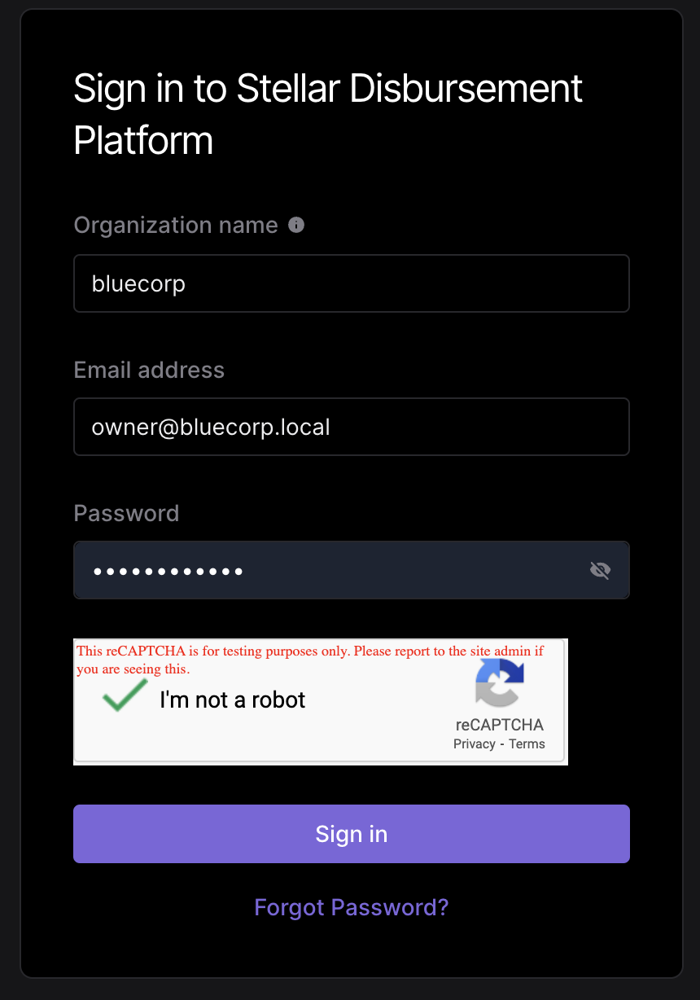

2. **Create First Disbursement**

   - Click `New Disbursement+` on the Dashboard screen. You should see a funded distribution account ready for your disbursement.
   - Use `Demo Wallet` as your wallet and choose a verification method.
   - Select `United States` as the Country.
   - Select `Date of Birth` as the verification method.

   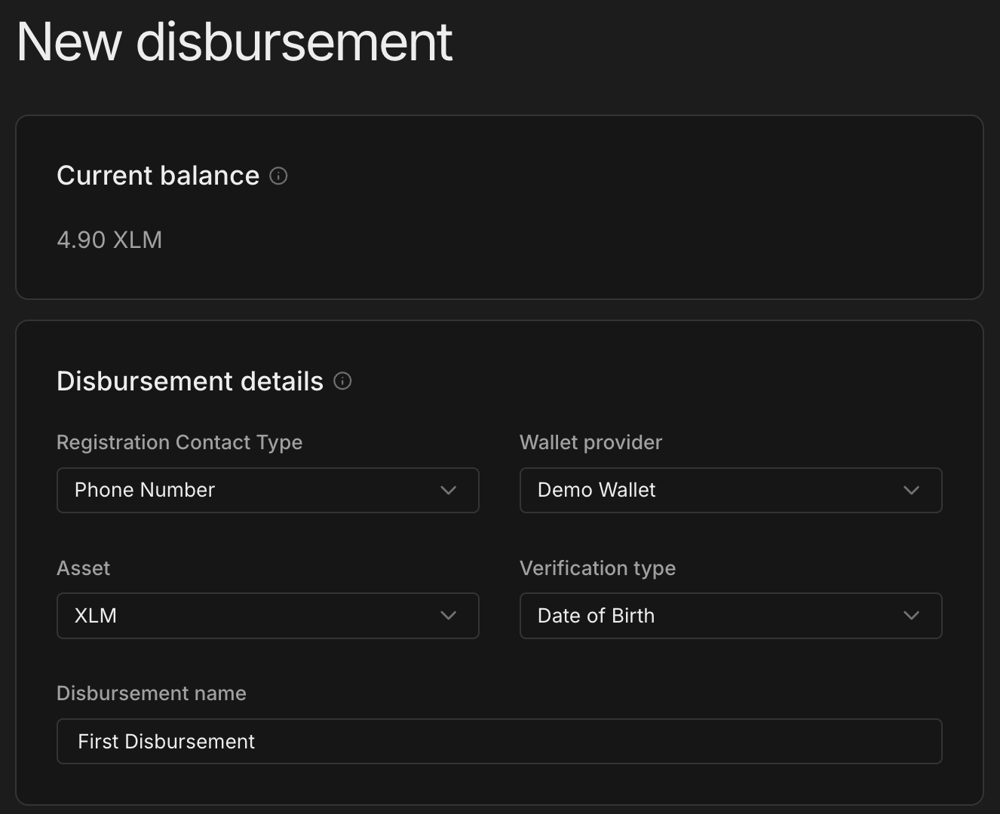

3. **Create and Upload a Disbursement File**

   - A sample file template is available [sample-disbursement.csv](./sample/sample-disbursement.csv).
   - Make sure to update the invalid phone numbers before using it.
   - Here is an example of a disbursement file with a single payment:
   
   ```csv
   phone,id,amount,verification
   +13163955627,4ba1,.1,1987-12-01
   ```

   - In this example, when registering, the payment receiver will be asked to verify their phone number and date of birth which will need to match the payment file instructions.

   - Upload the CSV and then click the Review button.  When you are ready to start the disbursement, click the `Confirm disbursement` button.
   
   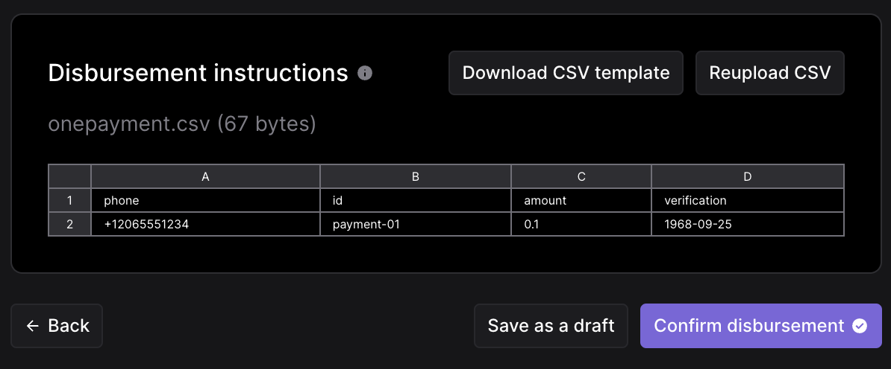

4. **View the Disbursement Details Dashboard**

   Navigate to Disbursement Details and see the payment in the disbursement is currently in a `Ready` state. This means the receiver has yet to accept the invitation and deposit the funds.

   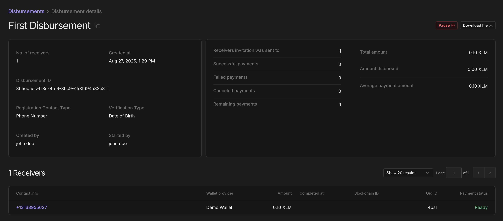

### Receive Payment to Digital Wallet (Deposit Flow)

Now deposit the disbursement payment into the digital wallet using the SEP-24 deposit flow from the Wallet Client Wallet to SDP.

1. Access locally installed [demo-wallet](http://localhost:4000) in your browser.
2. Click on `Generate Keypair for new account` to generate a new keypair. Make sure to save your public key & secret if you want to use this account later.
3. Click `Create account` (in front of public key) to actually create the account on the Stellar testnet.
4. Your newly created account will have 10,000 XLM.
   
   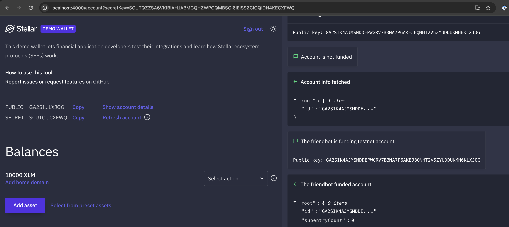

5. Clicking `Add Home Domain`  to edit the home domain. Enter `http://bluecorp.stellar.local:8000` and click the `Override` button.

   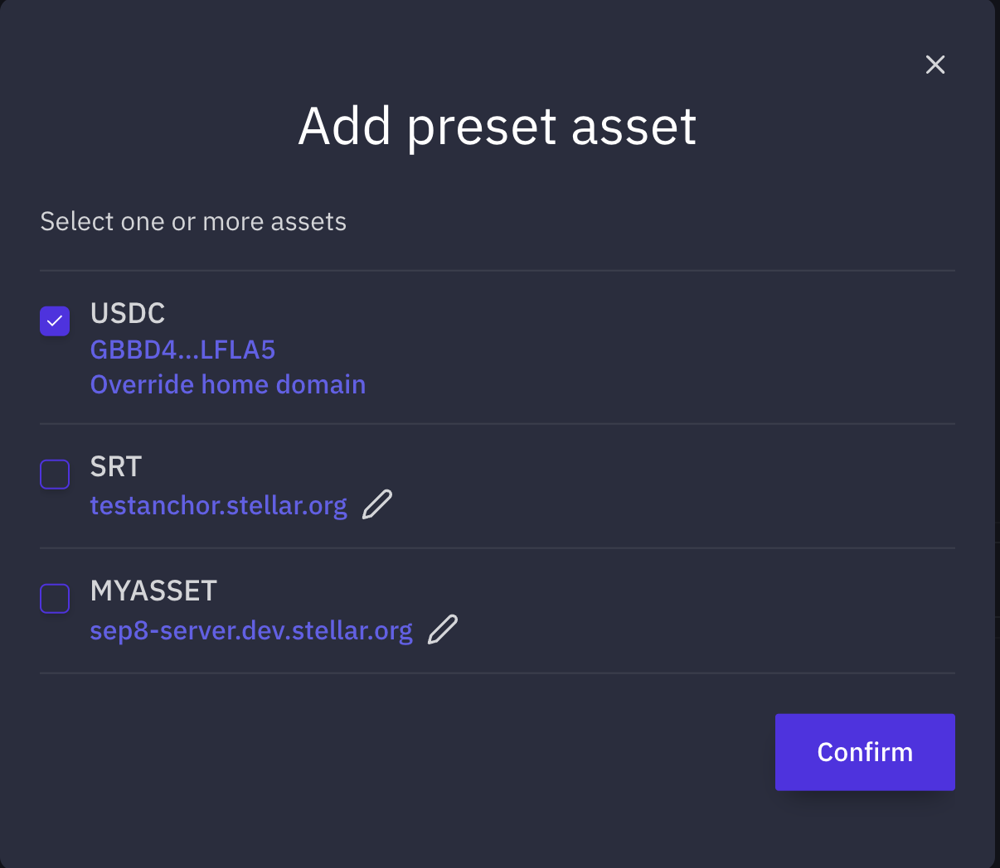

6. In the `Select action` dropdown, select `SEP-24 Deposit` and then click the `Start` button.
   
   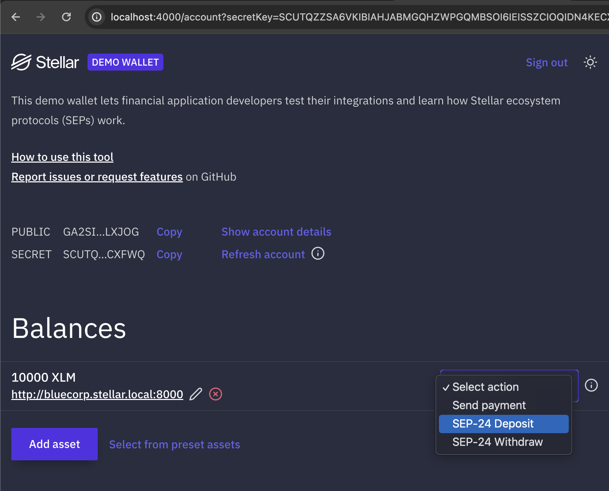

7.  In the new window, enter the phone number `+13163955627` from the disbursement CSV payment.
    
    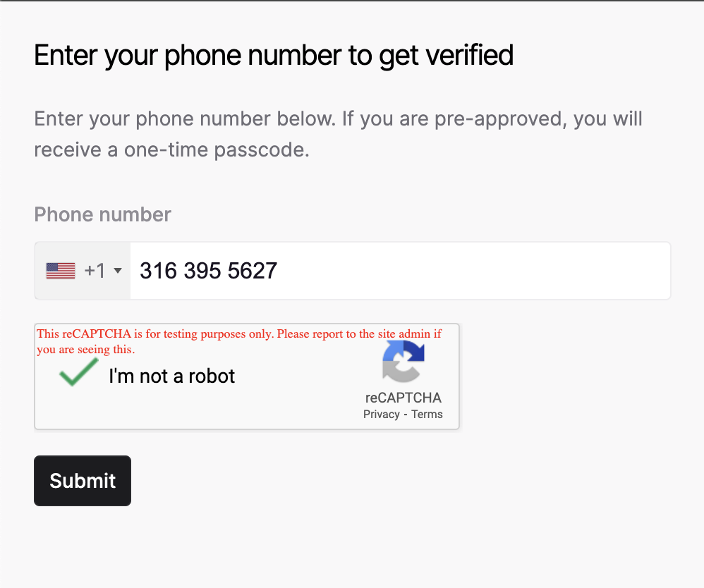

8. To verify the payment, enter the passcode and date of birth. You can use `000000` passcode or find the actual passcode in the `sdp-api` container logs.

    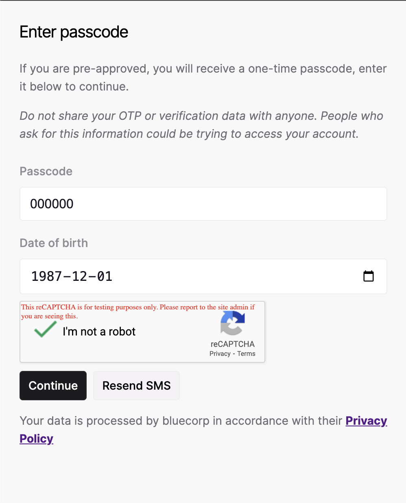

9. The SEP-24 interactive pop-up will confirm the registration was successful. At this point, the SDP can associate the wallet address with the receiver phone number. It should then start processing the transaction to send the payment. If you check the dashboard, the payment should be in a `PENDING` state.

    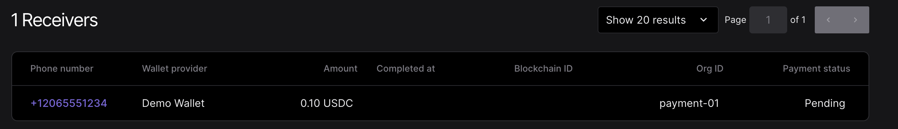

10. Once complete, the payment status will be `Success` and your wallet will have the USDC.

    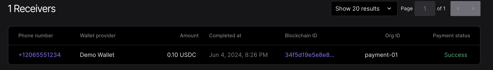

## Additional Development Environment Details

### Stellar Accounts and .env File

You need to create and configure two Stellar accounts to use the SDP. You can either create the accounts manually use the provided script to automate the process.

**Option 1: Manually Create and Configure Accounts**

1. Create and fund a Distribution account that will be used for sending funds to receivers. Follow the instructions [here](https://developers.stellar.org/docs/stellar-disbursement-platform/getting-started#create-and-fund-a-distribution-account).
2. Create a SEP-10 account for authentication. It can be created the same way as the distribution account but it doesn't need to be funded.
3. Create a `.env` file in the `dev` directory by copying the [env.example](./.env.example) file:
    ```sh
    cp .env.example .env
    ```
4. Update the `.env` file with the public and private keys of the two accounts created in the previous steps.

**Option 2: Use make_env.sh script to create accounts and .env file**

You can use the make_env.sh script to automatically create a stellar accounts for SEP-10 authentication and a funded (XLM and USDC) Stellar distribution account.  To run the make_env.sh script:

1. Use [make_env.sh](./scripts/make_env.sh) script to create stellar accounts and .env file automatically:
    1. Navigate to the `dev` directory from the terminal:
    ```sh
    cd dev
    ```
    2. Run the `make_env.sh` in the `scripts` folder.
    ```sh
    scripts/make_env.sh
    ```
    You should see output as follows:
    ```
    ❯ scripts/make_env.sh
    ====> 👀 Checking if .env environment file exists in <REPO_ROOT>/stellar-disbursement-platform-backend/dev
    .env file does not exist. Creating
    Generating SEP-10 signing keys...
    Generating distribution keys with funding...
    .env file created successfully 
    ====> ✅ Finished .env setup
    ```

### Building the SDP Docker Containers

A main.sh wrapper script has been included to help you bring up a local environment. The script stops and removes existing Docker containers, optionally deletes persistent volumes, and then uses Docker Compose to bring up new containers for the Stellar Disbursement Platform (SDP). This includes the SDP, Anchor Platform (for user registration), PostgreSQL database and a local demo wallet instance. It then initializes tenants if they don't exist and adds test users, setting up the local environment for the SEP-24 deposit flow.

1. Execute the following command to create all the necessary Docker containers needed to run SDP as well as provision sample tenants:
```sh
./main.sh
```
This will spin up the following services:

- `sdp_v2_database`: The main SDP and TSS database.
- `anchor-platform-postgres-db`: Database used by the anchor platform.
- `anchor-platform`: A local instance of the anchor platform.
- `sdp-api`: SDP service running on port `8000`.
- `sdp-tss`: Transaction Submission service.
- `sdp-frontend`: SDP frontend service running on port `3000`.
- `demo-wallet`: The demo wallet client that will be used as a receiver wallet, running on port `4000`.

### Remote Debugging

To help collaborators debug remotely against the Docker containers, the environment started with `main.sh` also launches a development version of the Dockerfile (`Dockerfile-development`). This builds and runs a debug Docker container for the SDP. A sample [launch.json](./sample/launch.json) is provided.

Follow these steps to debug remotely using VS Code or IntelliJ GoLang:

#### Ensure Docker Containers are Running:
Make sure the Docker containers are up and running by executing the `main.sh` script:

```sh
./main.sh
```

#### Using VS Code:
1. **Open the Project in VS Code:**
2. **Place the `launch.json` file in the `.vscode` directory within your project.** A sample `launch.json` is available [here](./sample/launch.json).
3. **Open the Debug panel** by clicking on the Debug icon in the Activity Bar on the side of VS Code.
4. **Select the `DEBUG SDP-API` configuration** (as configured in the sample [launch.json](./sample/launch.json)) from the dropdown.
5. **Click the green play button or press `F5` to start debugging.**

#### Using IntelliJ GoLang:
1. **Open the Project in IntelliJ:**
   Open your project in IntelliJ.

2. **Configure Remote Debugging:**
   - Go to `Run` > `Edit Configurations`.
   - Click on the `+` icon and select `Go Remote`.
   - Fill in the configuration details:
     - **Name:** DEBUG SDP-API
     - **Host:** 127.0.0.1
     - **Port:** 2345
     - **Package path:** (your project path)
     - **Mode:** remote
     - **Remote Path:** /app/github.com/stellar/stellar-disbursement-platform
     - **Local Path:** /${workspaceFolder}/stellar-disbursement-platform-backend

The debugger should now attach to the running Docker container, and you should be able to hit breakpoints and debug your code.

### Monitoring the SDP

The SDP supports monitoring via Prometheus and Grafana. 

#### Start Prometheus and Grafana containers 

The containers can be started by running the following command from the `dev` directory:

```sh
docker compose -p sdp-multi-tenant -f docker-compose-monitoring.yml up -d
```

This will start the following services:
* `prometheus`: Prometheus service running on port `9090`.
* `grafana`: Grafana service running on port `3002`. 

#### Load the SDP Grafana Dashboard

1. Access the Grafana dashboard by opening a browser and going to [http://localhost:3002](http://localhost:3002).
2. Log in with the default credentials:
   - Username: `admin`
   - Password: `admin`
3. Click on the `+` icon on the left sidebar and select `Import Dashboard`.
4. Copy the contents of the [dashboard.json](../resources/grafana/dashboard.json) file and paste it into the `Import via dashboard JSON model` text box.


## Troubleshooting

#### Sample Tenant Management Postman collection

A sample [Postman collection](./sample/SDP.postman_collection.json) is available in the `sample` directory. It contains endpoints for managing tenants, authentication, and other operations. You can import `SDP.postman_collection.json` into Postman to easily interact with the API.

#### Distribution account out of funds

Making payments requires transaction fees that are paid in XLM from the distribution account.  Payments will start failing if the distribution account does not have enough XLM to pay for these fees. To check this:
- Find the distribution account public key in `dev/docker-compose.yml` under the variable `DISTRIBUTION_PUBLIC_KEY`
- Access [https://horizon-testnet.stellar.org/accounts/:accountId](https://horizon-testnet.stellar.org/accounts/GARGKDIDH7WMKV5WWPK4BH4CKEQIZGWUCA4EUXCY5VICHTHLEBXVNVMW) in your browser and check the balance.  
- You could also check the balance using [demo wallet](https://demo-wallet.stellar.org/account?secretKey=YOUR_SECRET_KEY)
- If the balance is indeed low, here are some of the options to add additional XLM to the distribution account:

-- from the `dev` directory run the [create_and_fund.go](./scripts/create_and_fund.go) script and specify an existing account using the `--secret` option to specify the account secret key and the --fundxlm` option to add additional xlm via friendbot. Note: you will need to install golang.  example:
   ```sh
   ./go run scripts/create_and_fund.go --secret SECRET_KEY --fundxlm
   ```
-- Create a new funded account via Demo Wallet website and send funds to the Distribution account.
  - Access [https://demo-wallet.stellar.org/](https://demo-wallet.stellar.org/) in your browser.
  - Click on `Generate Keypair for new account` to create a new testnet account. Your account comes with 10,000 XLM.
  - Click on `Send` and enter the distribution account public key and the amount you want to send.
  - Using Freighter or Stellar Laboratory, swap the XLM for USDC if you wish to test with USDC.
  - Just use the newly created account (with 10,000 XLM) as the distribution account by updating the `DISTRIBUTION_PUBLIC_KEY` variable in `dev/docker-compose.yml` and restarting the `sdp-api` container.
  
