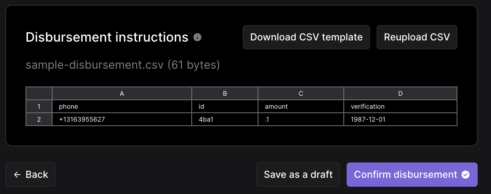
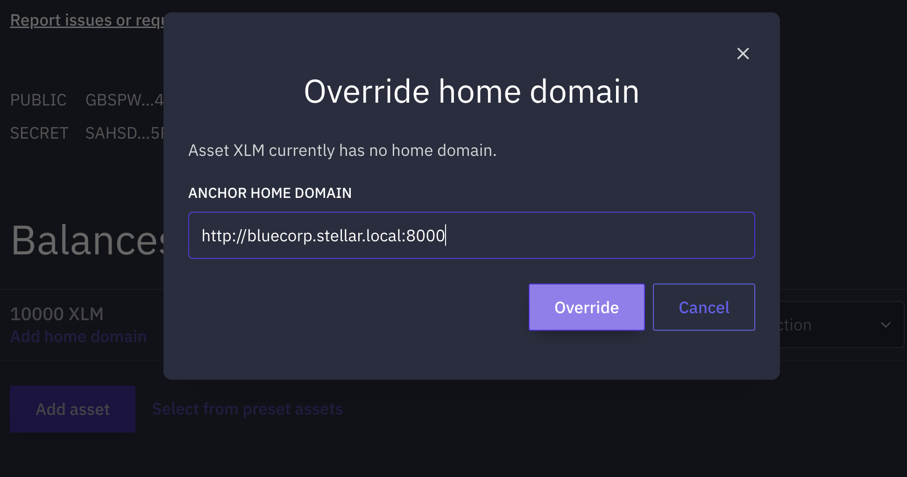
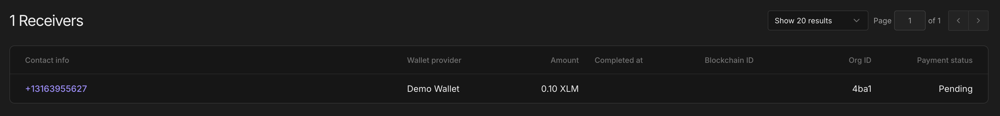
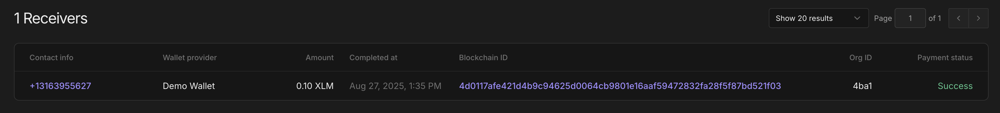

# Quick Start Guide

## Table of Contents

- [Quick Start Guide](#quick-start-guide)
  - [Table of Contents](#table-of-contents)
  - [Introduction](#introduction)
  - [Quick Setup and Deployment](#quick-setup-and-deployment)
    - [Pre-requisites](#pre-requisites)
    - [Clone the repository:](#clone-the-repository)
    - [Update local DNS](#update-local-dns)
    - [Set up local HTTPS (optional)](#set-up-local-https-optional)
    - [Automated Stellar Account Creation and .env Configuration](#automated-stellar-account-creation-and-env-configuration)
    - [Start Local Environment](#start-local-environment)
      - [Option 1: Using the Setup Wizard (Recommended)](#option-1-using-the-setup-wizard-recommended)
      - [Option 2: Using Docker Compose Directly](#option-2-using-docker-compose-directly)
      - [Option 3: Running Locally with Go (Development)](#option-3-running-locally-with-go-development)
  - [Mainnet Deployment](#mainnet-deployment)
    - [Mainnet Configuration](#mainnet-configuration)
    - [Mainnet Startup](#mainnet-startup)
    - [Login to the SDP and send a Disbursement](#login-to-the-sdp-and-send-a-disbursement)
    - [SEP10/SEP24 Endpoints](#sep10sep24-endpoints)
    - [Receive Payment to Digital Wallet (Deposit Flow)](#receive-payment-to-digital-wallet-deposit-flow)
  - [Additional Development Environment Details](#additional-development-environment-details)
    - [Stellar Accounts and .env File](#stellar-accounts-and-env-file)
    - [Building the SDP Docker Containers](#building-the-sdp-docker-containers)
    - [Remote Debugging](#remote-debugging)
      - [Ensure Docker Containers are Running:](#ensure-docker-containers-are-running)
      - [Using VS Code:](#using-vs-code)
      - [Using IntelliJ GoLang:](#using-intellij-golang)
    - [Monitoring the SDP](#monitoring-the-sdp)
      - [Start Prometheus and Grafana containers](#start-prometheus-and-grafana-containers)
      - [Load the SDP Grafana Dashboard](#load-the-sdp-grafana-dashboard)
  - [Troubleshooting](#troubleshooting)
      - [Sample Tenant Management Postman collection](#sample-tenant-management-postman-collection)
      - [Distribution account out of funds](#distribution-account-out-of-funds)

## Introduction

Follow these instructions to get started with the Stellar Disbursement Platform (SDP).

## Quick Setup and Deployment

### Pre-requisites

- **Docker:** Make sure you have Docker installed on your system. If not, you can download it from [here](https://www.docker.com/products/docker-desktop).
- **Git:** You will need Git to clone the repository. You can download it from [here](https://git-scm.com/downloads).
- **Go:** Required to run the setup wizard that generates your `.env`. Install from [golang.org/dl](https://golang.org/dl/).
- **jq:** Useful for some optional scripts and diagnostics. You can install it using Homebrew:
```sh
brew install jq
```

### Clone the repository:

```sh
git clone https://github.com/stellar/stellar-disbursement-platform.git
```

### Update local DNS

This update is needed to simulate the multi-tenant capabilities of the SDP. The SDP uses the subdomain of the request URL to resolve the tenant.
Be sure that the added tenant hosts are included in the host configuration file.
To check it, you can run the command `cat /etc/hosts`.
To include them, you can run command `sudo nano /etc/hosts` and insert the lines below:

```
127.0.0.1       bluecorp.stellar.local
127.0.0.1       redcorp.stellar.local
127.0.0.1       pinkcorp.stellar.local
```

### Set up local HTTPS (optional)

HTTPS is required for working with WebAuthn/passkeys. If you want the wizard to launch the dashboard over HTTPS (`https://<tenant>.stellar.local:3443`):

1. Install [mkcert](https://web.dev/articles/how-to-use-local-https):
   ```sh
   brew install mkcert
   mkcert -install
   ```
2. Generate local TLS certs (run from the repo root once):
   ```sh
   mkdir -p dev/certs
   mkcert -key-file dev/certs/stellar.local-key.pem -cert-file dev/certs/stellar.local.pem \
     "*.stellar.local" localhost 127.0.0.1 ::1
   ```
3. When the setup wizard asks, choose HTTPS.

### Automated Stellar Account Creation and .env Configuration

Use the unified setup wizard to generate accounts and a ready-to-use `.env`:

```sh
make setup
```

The wizard generates new keypairs and funds the distribution account with XLM on testnet (USDC auto-funding may be skipped depending on SDK compatibility), then writes `dev/.env` with values like:

```bash
# Generate a new keypair for SEP-10 signing
SEP10_SIGNING_PUBLIC_KEY=GCRSCJEVHB5JFXNZH3KYQRHSKDX3ZRFMMPKDPNX7AL3JSXJSILTV7DEW
SEP10_SIGNING_PRIVATE_KEY=SBEZHHWE2QPBIKNMVHPE5QD2JUUN2PLYNEHYQZZPQ7GYPYWULDTJ5RZU

# Generate a new keypair for the distribution account
DISTRIBUTION_PUBLIC_KEY=GBKLZHYBZR5HN6EBF5FP3A7ROMLUVWJPOWM6ZUUBB5JCK5LCIRCG65Q6
DISTRIBUTION_SEED=SDDWY3N3DSTR6SNCZTECOW6PNUIPOHDTMLKVWDQUTHLRNIKMAUIT46M6

# CHANNEL_ACCOUNT_ENCRYPTION_PASSPHRASE
CHANNEL_ACCOUNT_ENCRYPTION_PASSPHRASE=SDDWY3N3DSTR6SNCZTECOW6PNUIPOHDTMLKVWDQUTHLRNIKMAUIT46M6

# Distribution signer
DISTRIBUTION_ACCOUNT_ENCRYPTION_PASSPHRASE=SDDWY3N3DSTR6SNCZTECOW6PNUIPOHDTMLKVWDQUTHLRNIKMAUIT46M6
```

### Start Local Environment

There are three ways to run the SDP:

#### Option 1: Using the Setup Wizard (Recommended)

Start all services and provision sample tenants using the setup wizard:
```sh
make setup
```

The setup wizard will:
1. Create or select an `.env` configuration under the `dev/` directory
2. Generate Stellar accounts if needed (with testnet funding)
3. Optionally launch the Docker environment immediately
4. Optionally initialize tenants and test users

For existing configurations, you can launch directly by selecting from available `.env` files in the `dev/` directory.

#### Option 2: Using Docker Compose Directly

If you already have a configured `.env` file, you can start the services directly:

```sh
cd dev
docker compose up -d
```

To stop the services:
```sh
docker compose down
```

#### Option 3: Running Locally with Go (Development)

For local development outside Docker, run from the repo root:

```sh
go run main.go serve \
  --env-file ./dev/.env.https-testnet \
  --database-url "postgres://postgres@localhost:5432/sdp_mtn?sslmode=disable"
```

You can also run the TSS by using the `tss` command instead of `serve`.

```sh
go run main.go tss \
  --env-file ./dev/.env.https-testnet \
  --database-url "postgres://postgres@localhost:5432/sdp_mtn?sslmode=disable"
```

**Important Notes:**
- Use `--env-file` to specify which configuration to load (e.g., `./dev/.env.https-testnet`)
- Override `--database-url` to use `localhost:5432` instead of `db:5432` (Docker hostname)
- Ensure PostgreSQL is running locally and accessible on port 5432

You can also use the `ENV_FILE` and `DATABASE_URL` environment variables instead of the flags:
```sh
ENV_FILE=./dev/.env.https-testnet \
DATABASE_URL="postgres://postgres@localhost:5432/sdp_mtn?sslmode=disable" \
  go run main.go serve
```

**Volumes and Data Isolation**

- The Postgres volumes are network-scoped using the pattern `${COMPOSE_PROJECT_NAME}_postgres-db-${NETWORK_TYPE}` and `${COMPOSE_PROJECT_NAME}_postgres-ap-db-${NETWORK_TYPE}`. Compose reads `NETWORK_TYPE` from `dev/.env`.
- Compose project name is automatically derived from the setup name (e.g., `sdp-testnet`, `sdp-mainnet1`).
- To fully reset data, manually remove Docker volumes or recreate the environment through the setup wizard.

## Mainnet Deployment

⚠️ **IMPORTANT**: Mainnet deployment is for production use with real funds. Exercise extreme caution.

### Mainnet Configuration

The setup wizard automatically handles mainnet configuration when you select "pubnet (mainnet)":

1. **Automatic Configuration**: The wizard sets all mainnet-specific environment variables:
   - `NETWORK_TYPE=mainnet`
   - `NETWORK_PASSPHRASE=Public Global Stellar Network ; September 2015`
   - `HORIZON_URL=https://horizon.stellar.org`
   - `DATABASE_NAME=sdp_mainnet` (separate database for isolation)
   - `DISABLE_MFA=false` (MFA enforced for mainnet)

2. **Account Requirements**:
   - **Distribution Account**: Must be funded with sufficient XLM for creating channel accounts, distribution accounts for different tenants, and transaction fees
   - **SEP10 Signing Account**: Used for authentication only, no funding required
   - **Assets**: Must use mainnet asset issuers (not testnet issuers)

### Mainnet Startup

Use the setup wizard to create and launch a mainnet configuration:
```sh
make setup
```

1. Select "Create new configuration" or choose an existing mainnet `.env` file
2. Choose "pubnet (mainnet)" when prompted for network selection
3. The wizard will automatically configure all mainnet-specific settings
4. Choose to launch the environment when prompted
5. The system will detect mainnet configuration and enforce security settings automatically

> Note: The legacy `dev/scripts/make_env.sh` has been removed. Use the setup wizard instead (`make setup`).

### Login to the SDP and send a Disbursement

> [!NOTE]
> In the following section, we will assume you're using the `bluecorp` tenant that was provisioned when you started the stack.

The startup prints Login information for each tenant.
```
🎉🎉🎉🎉 SUCCESS! 🎉🎉🎉🎉
Login URLs for each tenant:
🔗Tenant `redcorp`: [http://redcorp.stellar.local:3000](http://redcorp.stellar.local:3000)
  username: `owner@redcorp.local`
  password: `Password123!`
🔗Tenant `bluecorp`: [http://bluecorp.stellar.local:3000](http://bluecorp.stellar.local:3000)
  username: `owner@bluecorp.local`
  password: `Password123!`
🔗Tenant `pinkcorp`: [http://pinkcorp.stellar.local:3000](http://pinkcorp.stellar.local:3000)
  username: `owner@pinkcorp.local`
  password: `Password123!`
```

1. Navigate to the SDP frontend service by opening a browser and going to [http://bluecorp.stellar.local:3000](http://bluecorp.stellar.local:3000).

   

2. **Create First Disbursement**

   - Click `New Disbursement+` on the Dashboard screen. You should see a funded distribution account ready for your disbursement.
   - Use `Demo Wallet` as your wallet and choose a verification method.
   - Select `United States` as the Country.
   - Select `Date of Birth` as the verification method.

   

3. **Create and Upload a Disbursement File**

   - A sample file template is available [sample-disbursement.csv](./sample/sample-disbursement.csv).
   - Make sure to update the invalid phone numbers before using it.
   - Here is an example of a disbursement file with a single payment:

   ```csv
   phone,id,amount,verification
   +13163955627,4ba1,.1,1987-12-01
   ```

   - In this example, when registering, the payment receiver will be asked to verify their phone number and date of birth which will need to match the payment file instructions.

   - Upload the CSV and then click the Review button. When you are ready to start the disbursement, click the `Confirm disbursement` button.

   

4. **View the Disbursement Details Dashboard**

   Navigate to Disbursement Details and see the payment in the disbursement is currently in a `Ready` state. This means the receiver has yet to accept the invitation and deposit the funds.

   

### SEP10/SEP24 Endpoints

The SDP now provides native SEP10 and SEP24 endpoints for wallet integration:

**SEP10 Authentication Endpoints:**
- `GET /auth` - Generate authentication challenge
- `POST /auth` - Validate challenge and receive JWT token

**SEP24 Interactive Deposit Endpoints:**
- `GET /sep24/info` - Get supported assets and capabilities
- `POST /sep24/transactions/deposit/interactive` - Initiate interactive deposit
- `GET /sep24/transactions` - Get transaction status

**Stellar.toml Configuration:**
The SDP automatically generates `stellar.toml` files that point to the native SEP10/SEP24 endpoints.

### Receive Payment to Digital Wallet (Deposit Flow)

Now deposit the disbursement payment into the digital wallet using the SEP-24 deposit flow from the Wallet Client Wallet to SDP.

1. Access locally installed [demo-wallet](http://localhost:4000) in your browser.
2. Click on `Generate Keypair for new account` to generate a new keypair. Make sure to save your public key & secret if you want to use this account later.
3. Click `Create account` (in front of public key) to actually create the account on the Stellar testnet.
4. Your newly created account will have 10,000 XLM.

   

5. Clicking `Add Home Domain`  to edit the home domain. Enter `http://bluecorp.stellar.local:8000` and click the `Override` button.

   

6. In the `Select action` dropdown, select `SEP-24 Deposit` and then click the `Start` button.

   

7.  In the new window, enter the phone number `+13163955627` from the disbursement CSV payment.

    

8. To verify the payment, enter the passcode and date of birth. You can use `000000` passcode or find the actual passcode in the `sdp-api` container logs.


9. The SEP-24 interactive pop-up will confirm the registration was successful. At this point, the SDP can associate the wallet address with the receiver phone number. It should then start processing the transaction to send the payment. If you check the dashboard, the payment should be in a `PENDING` state.

    

10. Once complete, the payment status will be `Success` and your wallet will have the USDC.

    

## Additional Development Environment Details

### Stellar Accounts and .env File

You need to create and configure two Stellar accounts to use the SDP. You can either create the accounts manually use the provided script to automate the process.

**Option 1: Manually Create and Configure Accounts**

1. Create and fund a Distribution account that will be used for sending funds to receivers. Follow the instructions [here](https://developers.stellar.org/docs/platforms/stellar-disbursement-platform/getting-started#create-and-fund-a-distribution-account).
2. Create a SEP-10 account for authentication. It can be created the same way as the distribution account but it doesn't need to be funded.
3. Create a `.env` file in the `dev` directory by copying the [env.example](.backup/.env.example) file:
   ```sh
   cp .env.example .env
   ```
4. Update the `.env` file with the public and private keys of the two accounts created in the previous steps.

**Option 2: Use the setup wizard to create accounts and `.env` automatically**

From the repo root, run the wizard:

```sh
make setup
```

This will generate SEP-10 and distribution keys, fund the distribution with XLM + USDC on testnet, and write `dev/.env`.

### Building the SDP Docker Containers

The setup wizard launches the local environment (Docker Compose), initializes tenants, and adds test users. It spins up the following services:

- `sdp_v2_database`: The main SDP and TSS database.
- `sdp-api`: SDP service running on port `8000`.
- `sdp-tss`: Transaction Submission service.
- `sdp-frontend`: SDP frontend service running on port `3000`.
- `demo-wallet`: The demo wallet client that will be used as a receiver wallet, running on port `4000`.

### Remote Debugging

To help collaborators debug remotely against the Docker containers, the environment started with the setup wizard also launches a development version of the Dockerfile (`Dockerfile-development`). This builds and runs a debug Docker container for the SDP. A sample [launch.json](./sample/launch.json) is provided.

Follow these steps to debug remotely using VS Code or IntelliJ GoLang:

#### Ensure Docker Containers are Running:

Make sure the Docker containers are up and running using the setup wizard:

```sh
make setup
```

#### Using VS Code:

1. **Open the Project in VS Code:**
2. **Place the `launch.json` file in the `.vscode` directory within your project.** A sample `launch.json` is available [here](./sample/launch.json).
3. **Open the Debug panel** by clicking on the Debug icon in the Activity Bar on the side of VS Code.
4. **Select the `DEBUG SDP-API` configuration** (as configured in the sample [launch.json](./sample/launch.json)) from the dropdown.
5. **Click the green play button or press `F5` to start debugging.**

#### Using IntelliJ GoLang:

1. **Open the Project in IntelliJ:**
   Open your project in IntelliJ.

2. **Configure Remote Debugging:**
   - Go to `Run` > `Edit Configurations`.
   - Click on the `+` icon and select `Go Remote`.
   - Fill in the configuration details:
     - **Name:** DEBUG SDP-API
     - **Host:** 127.0.0.1
     - **Port:** 2345
     - **Package path:** (your project path)
     - **Mode:** remote
     - **Remote Path:** /app/github.com/stellar/stellar-disbursement-platform
     - **Local Path:** /${workspaceFolder}/stellar-disbursement-platform-backend

The debugger should now attach to the running Docker container, and you should be able to hit breakpoints and debug your code.

### Monitoring the SDP

The SDP supports monitoring via Prometheus and Grafana.

#### Start Prometheus and Grafana containers

The containers can be started by running the following command from the `dev` directory:

```sh
docker compose -p sdp-multi-tenant -f docker-compose-monitoring.yml up -d
```

This will start the following services:

- `prometheus`: Prometheus service running on port `9090`.
- `grafana`: Grafana service running on port `3002`.

#### Load the SDP Grafana Dashboard

1. Access the Grafana dashboard by opening a browser and going to [http://localhost:3002](http://localhost:3002).
2. Log in with the default credentials:
   - Username: `admin`
   - Password: `admin`
3. Click on the `+` icon on the left sidebar and select `Import Dashboard`.
4. Copy the contents of the [dashboard.json](../resources/grafana/dashboard.json) file and paste it into the `Import via dashboard JSON model` text box.

## Troubleshooting

#### Sample Tenant Management Postman collection

A sample [Postman collection](./sample/SDP.postman_collection.json) is available in the `sample` directory. It contains endpoints for managing tenants, authentication, and other operations. You can import `SDP.postman_collection.json` into Postman to easily interact with the API.

#### Distribution account out of funds

Making payments requires transaction fees that are paid in XLM from the distribution account. Payments will start failing if the distribution account does not have enough XLM to pay for these fees. To check this:

- Find the distribution account public key in `dev/docker-compose.yml` under the variable `DISTRIBUTION_PUBLIC_KEY`
- Access [https://horizon-testnet.stellar.org/accounts/:accountId](https://horizon-testnet.stellar.org/accounts/GARGKDIDH7WMKV5WWPK4BH4CKEQIZGWUCA4EUXCY5VICHTHLEBXVNVMW) in your browser and check the balance.
- You could also check the balance using [demo wallet](https://demo-wallet.stellar.org/account?secretKey=YOUR_SECRET_KEY)
- If the balance is indeed low, here are some of the options to add additional XLM to the distribution account:

-- From the repo root, use the funding tool to add XLM/USDC to an existing account:
```sh
   go run tools/sdp-create-and-fund/main.go --secret SECRET_KEY --fundxlm
```

-- Create a new funded account via Demo Wallet website and send funds to the Distribution account.

- Access [https://demo-wallet.stellar.org/](https://demo-wallet.stellar.org/) in your browser.
- Click on `Generate Keypair for new account` to create a new testnet account. Your account comes with 10,000 XLM.
- Click on `Send` and enter the distribution account public key and the amount you want to send.
- Using Freighter or Stellar Laboratory, swap the XLM for USDC if you wish to test with USDC.
- Just use the newly created account (with 10,000 XLM) as the distribution account by updating the `DISTRIBUTION_PUBLIC_KEY` variable in `dev/docker-compose.yml` and restarting the `sdp-api` container.
