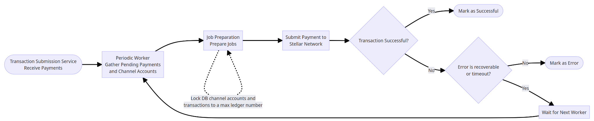

# Transaction Submission Service

The Transaction Submission Service (TSS) allows for transaction submission at scale to the Stellar network from a single [source/distribution account](#distribution-account), which is made possible through the use of [channel accounts](https://developers.stellar.org/docs/encyclopedia/channel-accounts) spawned from said distribution account. In the context of SDP, the TSS is responsible for submitting transactions to the network for each respective payment read from a shared database table that is "queued" by the SDP. It works seamlessly by way of graceful error handling and transaction retries alongside mechanisms such as [transaction fee bumps](#transaction-fee-bumps) and adjustment of the rate at which new transactions are polled when certain errors are encountered.

Use of the Transaction Submission Service requires at least a single aforementioned channel account to be seeded in storage in advanced. We provide a set of CLI's that can be used to create, delete, and change the number of channel accounts the service manages with ease. To learn how to use these commands, please refer to the [Channel Accounts Management](#channel-accounts-management) section below.

## Transaction Fee Bumps
During periods of high network activity, fee surges may occur as many submitted transactions from different sources may compete to be included into the next ledger. Running the TSS itself against a large number of payments with a higher than average configured accounts count will result in a high likelihood of this happening. To ensure that submitted transactions are competitive enough to be included in the ledger in a reasonable time window, the TSS utilizes fee bump transactions as part of its retry process. See [here](https://developers.stellar.org/docs/encyclopedia/fee-bump-transactions) for Stellar's official documentation about fee-bump transactions.

## Distribution Account
The distribution account's balance is where the spending amount will be pulled from and also acts as the [sponsored reserve](https://developers.stellar.org/docs/encyclopedia/sponsored-reserves), used to pay the base reserve for any of its channel accounts that exist onchain.

Though the transaction submitter and channel account management commands allow the distribution private key to be specified upfront through the `distribution-seed` flag, we recommend users to configure it through the environment variable `DISTRIBUTION_SEED` in a one and done way to mitigate risks of exposing this information. For the distribution seed to be valid, the account associated with it must exist on the network.

In terms of balance, the distribution account needs to hold some XLM balance in order to pay for gas fees and also to support the creation of Channel accounts (1 XLM is needed per channel account). The distribution account also must contain a balance of the assets that are specified by the payments/transactions records otherwise, these transactions will fail with an error explaining the reason. To learn how to fund a distribution account in testnet, refer to the section ["Create and Fund a Distribution Account"](https://developers.stellar.org/docs/stellar-disbursement-platform/getting-started#create-and-fund-a-distribution-account) in the SDP startup guide.

## TSS Flow


Running the transaction submitter command [detailed below](#transaction-submitter) spawns a worker that continously polls the database for any 'queued' payments that have not yet reached some terminal state at a configured polling interval. 

When such a payment is found, the worker attempts to look for any free channel accounts and locks the payment and account records to the same ledger number as a bundle so to prevent the occurence of race conditions that guarantee failed transactions (i.e. attempting to submit multiple per channel account concurrently resulting in `tx_bad_seq` errors, etc...), then kicks off a job for the payment to create, sign, and submit to the network a transaction via Horizon.

### Horizon Error Handling
Instead of each Horizon error code being handled in a bespoke manner, they are categorized into 2 buckets - ones that result in transactions that are and are not eligible for resubmission. Errors received from Horizon that allow the transaction to be retriable are as listed:
- `429`: Too Many Requests
- `504`: Timeouts
- `400`'s with error code `tx_insufficient_fee`, `tx_too_late`, `tx_bad_seq`

## Transaction Submitter
### CLI Usage: `tss`
```sh
$ stellar-disbursement-platform tss --help
Run the Transaction Submission Service

Usage:
  stellar-disbursement-platform tss [flags]

Flags:
      --crash-tracker-type string    Crash tracker type. Options: "SENTRY", "DRY_RUN" (CRASH_TRACKER_TYPE) (default "DRY_RUN")
      --distribution-seed string     The private key of the Stellar account used to disburse funds (DISTRIBUTION_SEED)
  -h, --help                         help for tss
      --horizon-url string           Horizon URL (HORIZON_URL) (default "https://horizon-testnet.stellar.org/")
      --max-base-fee int             The max base fee for submitting a Stellar transaction (MAX_BASE_FEE) (default 100)
      --num-channel-accounts int     Number of channel accounts to utilize for transaction submission (NUM_CHANNEL_ACCOUNTS) (default 2)
      --queue-polling-interval int   Polling interval (seconds) to query the database for pending transactions to process (QUEUE_POLLING_INTERVAL) (default 6)
      --tss-metrics-port int         Port where the metrics server will be listening on. Default: 9002" (TSS_METRICS_PORT) (default 9002)
      --tss-metrics-type string      Metric monitor type. Options: "TSS_PROMETHEUS" (TSS_METRICS_TYPE) (default "TSS_PROMETHEUS")

Global Flags:
      --base-url string             The SDP UI base URL. (BASE_URL) (default "http://localhost:8000")
      --database-url string         Postgres DB URL (DATABASE_URL) (default "postgres://localhost:5432/sdp?sslmode=disable")
      --environment string          The environment where the application is running. Example: "development", "staging", "production". (ENVIRONMENT) (default "development")
      --log-level string            The log level used in this project. Options: "TRACE", "DEBUG", "INFO", "WARN", "ERROR", "FATAL", or "PANIC". (LOG_LEVEL) (default "TRACE")
      --network-passphrase string   The Stellar network passphrase (NETWORK_PASSPHRASE) (default "Test SDF Network ; September 2015")
      --sentry-dsn string           The DSN (client key) of the Sentry project. If not provided, Sentry will not be used. (SENTRY_DSN)
```

## Channel Accounts Management

Channel Accounts are used to increase throughput when submitting transaction to the Stellar Network, and are a prerequisite for using TSS. This set of CLI tools should enable almost all use cases for management of Channel Accounts (both onchain and in the database).

### CLI Usage: `channel-accounts`
```sh
$ stellar-disbursement-platform channel-accounts --help
Channel accounts related commands

Usage:
  stellar-disbursement-platform channel-accounts [command]

Available Commands:
  create      Create channel accounts
  delete      Delete a specified channel account from storage and on the network
  ensure      Ensure we are managing exactly the number of channel accounts equal to some specified count by dynamically increasing or decreasing the number of managed channel accounts in storage and onchain
  verify      Verify the existence of all channel accounts in the database on the Stellar newtwork
  view        View all channel accounts currently managed in the database
  
Flags:
  -h, --help                 help for channel-accounts
      --horizon-url string   Horizon URL" (HORIZON_URL) (default "https://horizon-testnet.stellar.org/")

Global Flags:
      --base-url string             The SDP UI base URL. (BASE_URL) (default "http://localhost:8000")
      --database-url string         Postgres DB URL (DATABASE_URL) (default "postgres://localhost:5432/sdp?sslmode=disable")
      --environment string          The environment where the application is running. Example: "development", "staging", "production". (ENVIRONMENT) (default "development")
      --log-level string            The log level used in this project. Options: "TRACE", "DEBUG", "INFO", "WARN", "ERROR", "FATAL", or "PANIC". (LOG_LEVEL) (default "TRACE")
      --network-passphrase string   The Stellar network passphrase (NETWORK_PASSPHRASE) (default "Test SDF Network ; September 2015")
      --sentry-dsn string           The DSN (client key) of the Sentry project. If not provided, Sentry will not be used. (SENTRY_DSN)

Use "stellar-disbursement-platform channel-accounts [command] --help" for more information about a command.
```

### CLI Usage: `channel-accounts create`
```sh
channel-accounts create --help
Usage:
  stellar-disbursement-platform channel-accounts create [flags]

Flags:
      --distribution-seed string          The private key of the Stellar account that will be used to sponsor the channel accounts (DISTRIBUTION_SEED)
  -h, --help                              help for create
      --max-base-fee int                  The max base fee for submitting a stellar transaction (MAX_BASE_FEE) (default 100)
      --num-channel-accounts-create int   The desired number of channel accounts to be created (NUM_CHANNEL_ACCOUNTS_CREATE) (default 1)
```

### CLI Usage: `channel-accounts ensure`
```sh
channel-accounts ensure --help
Usage:
  stellar-disbursement-platform channel-accounts ensure [flags]

Flags:
      --distribution-seed string          The private key of the Stellar account used to sponsor existing channel accounts (DISTRIBUTION_SEED)
  -h, --help                              help for ensure
      --max-base-fee int                  The max base fee for submitting a stellar transaction (MAX_BASE_FEE) (default 100)
      --num-channel-accounts-ensure int   The desired number of channel accounts to manage (NUM_CHANNEL_ACCOUNTS_ENSURE) (default 1)
```

### CLI Usage: `channel-accounts delete`
```sh
channel-accounts delete --help
Usage:
  stellar-disbursement-platform channel-accounts delete [flags]

Flags:
      --channel-account-id string   The ID of the channel account to delete (CHANNEL_ACCOUNT_ID)
      --delete-all-accounts         Delete all managed channel accoounts in the database and on the network (DELETE_ALL_ACCOUNTS)
      --distribution-seed string    The private key of the Stellar account used to sponsor the channel account specified (DISTRIBUTION_SEED)
  -h, --help                        help for delete
      --max-base-fee int            The max base fee for submitting a stellar transaction (MAX_BASE_FEE) (default 100)
```

### CLI Usage: `channel-accounts verify`
```sh
channel-accounts verify --help
Usage:
  stellar-disbursement-platform channel-accounts verify [flags]

Flags:
      --delete-invalid-accounts   Delete channel accounts from storage that are verified to be invalid on the network (DELETE_INVALID_ACCOUNTS)
  -h, --help                      help for verify
```

### CLI Usage: `channel-accounts verify`
```sh
channel-accounts verify --help
Usage:
  stellar-disbursement-platform channel-accounts verify [flags]

Flags:
      --delete-invalid-accounts   Delete channel accounts from storage that are verified to be invalid on the network (DELETE_INVALID_ACCOUNTS)
  -h, --help                      help for verify
```

### CLI Usage: `channel-accounts view`
```sh
channel-accounts view --help
Usage:
  stellar-disbursement-platform channel-accounts view [flags]

Flags:
  -h, --help   help for view
```

## Testing
### Mocks
TSS unit tests rely on mocks of its interfaces auto-generated by mockery. For installation instructions, see [here](https://vektra.github.io/mockery/installation/). 

Refer to the output to learn how to annotate interfaces and about the different flags that you can leverage to manipulate the output.
```
mockery --help
```

To generate the mocks
```
go generate ./...
```
