# Dashboard Grafana SDPV2

This dashboard template shows metrics that are exported in the application using prometheus. Currently, the metrics available in this template are the `HTTP request` and `Database Query` metrics. In the future new metrics will be added including business ones.

To import the file `dashboard.json` into a grafana instance you need to follow [these steps](https://grafana.com/docs/grafana/latest/dashboards/manage-dashboards/#import-a-dashboard). When importing the dashboard, you need to add the prometheus instance that is scraping the application metrics as a data source in grafana. More information in [this link](https://grafana.com/docs/grafana/latest/datasources/prometheus)

## HTTP Requests Metrics

At the moment the HTTP request metrics are being monitored by 7 panels, and this panels can be filtered by:

- Request endpoint
- HTTP method
- Status returned by request
- Instance that is running the app

### Request HTTP Rate

Chart responsible for calculating the number of requests per second performed in a 5-minute interval. Can be filtered by route, method, status, and instance.

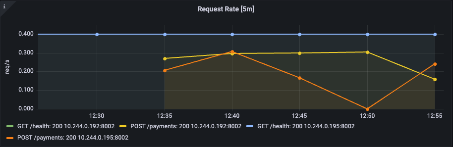

### Request HTTP Average Time

Chart responsible for calculating the average time in ms that a request takes to be executed in a 5-minute interval. Can be filtered by route, method, status, and instance.

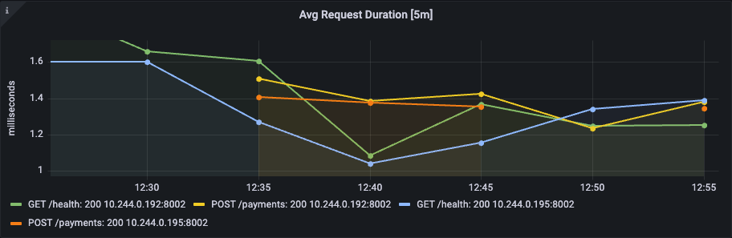

### Request HTTP Rate Aggregate By Instance

Chart responsible for calculating the number of requests per second performed in a 5-minute interval aggregated by the average of all instances. Can be filtered by route, method, and status.

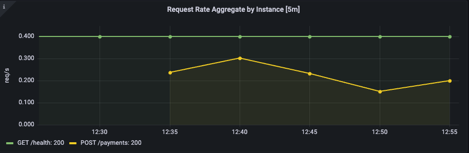

### Request HTTP Average Time Aggregate By Instance

Chart responsible for calculating the average time in ms that a request takes to be executed in a 5-minute interval aggregated by the average of all instances. Can be filtered by route, method, and status.

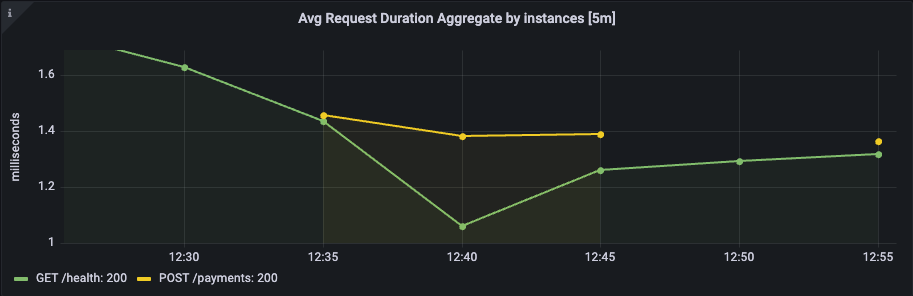

### HTTP Request Quantiles

Graph responsible for showing the duration quantiles of http requests calculated by Prometheus. Can be filtered by route, method, status, and instance.

### Total and Average HTTP Requests

Panels responsible for showing the aggregate sum of requests performed by the application since it started running. And also the average time these requests take to execute aggregated by the average. Can be filtered by route, method, status, and instance.

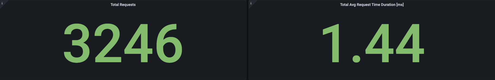

## DB Query Metrics

At the moment the DB Query metrics are being monitored by 10 panels, and this panels can be filtered by:

- Query type (Select, Update, Insert, Create)
- Instance that is running the app

The database metrics are separated into successful and failure queries.

### Successful DB Query Rate

Chart responsible for calculating the number of successful queries per second performed in a 5-minute interval. Can be filtered by query_type and instance.

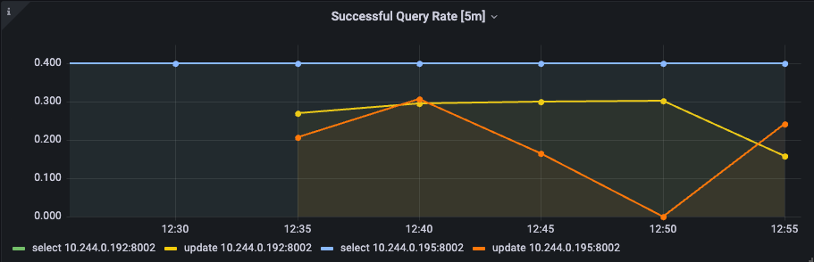

### Failure DB Query Rate

Chart responsible for calculating the number of failed queries per second performed in a 5-minute interval. Can be filtered by query_type and instance.

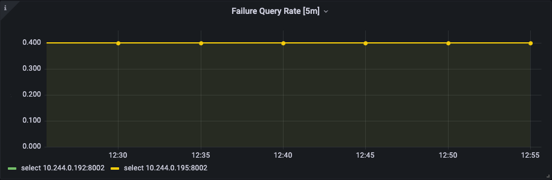

### Successful DB Query Average Time

Chart responsible for calculating the average time in ms that a successful query takes to be executed in a 5-minute interval. Can be filtered by query_type and instance.

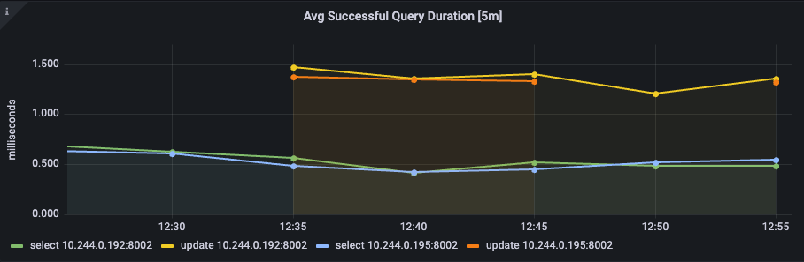

### Failure DB Query Average Time

Chart responsible for calculating the average time in ms that a failed query takes to be executed in a 5-minute interval. Can be filtered by query_type and instance.

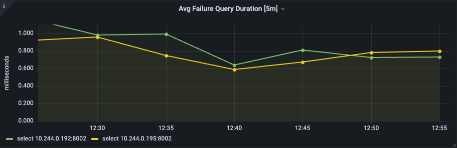

### Successful DB Query Rate Aggregate By Instance

Chart responsible for calculating the number of successful queries per second performed in a 5-minute interval aggregated by the average of all instances. Can be filtered by query_type.

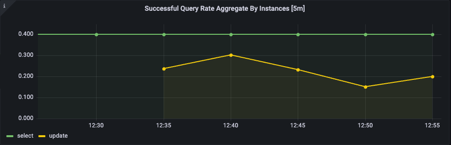

### Failure DB Query Rate Aggregate By Instance

Chart responsible for calculating the number of failed queries per second performed in a 5-minute interval aggregated by the average of all instances. Can be filtered by query_type.

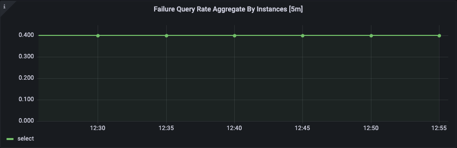

### Successful DB Query Average Time Aggregate By Instance

Chart responsible for calculating the average time in ms that a successful query takes to be executed in a 5-minute interval aggregated by the average of all instances. Can be filtered by query_type.

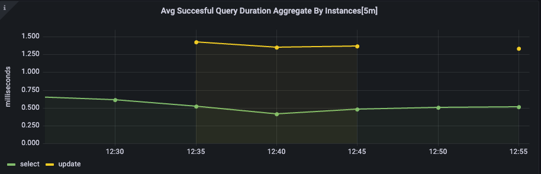

### Failure DB Query Average Time Aggregate By Instance

Chart responsible for calculating the average time in ms that a failed query takes to be executed in a 5-minute interval aggregated by the average of all instances. Can be filtered by query_type.

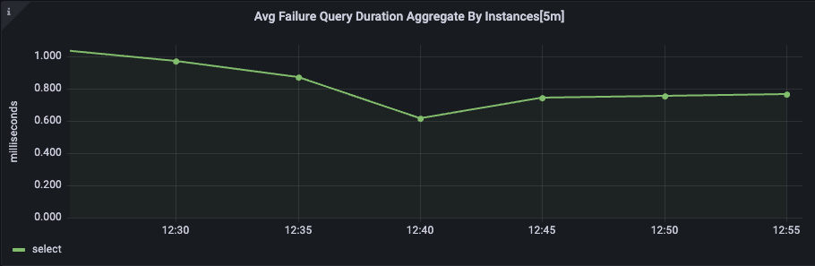

### Successful DB Query Quantiles

Graph responsible for showing the duration quantiles of successful queries calculated by Prometheus. Can be filtered by query_type and instance.

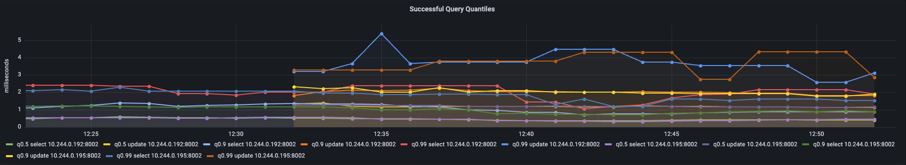

### Failure DB Query Quantiles

Graph responsible for showing the duration quantiles of failed queries calculated by Prometheus. Can be filtered by query_type and instance.

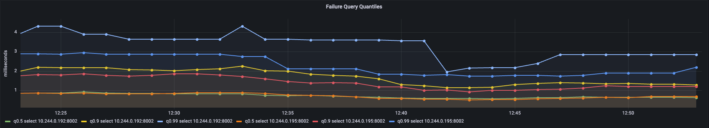
